# Ist eine europäische HFEA Strategie möglich?

**ZL;NG**

* *55% UPRO und 45% TMF performen besser als 40% UPRO und 60% TMF*
* *Statt 45% TMF kann man auch 45% TLT nehmen (ungehebelt), was nur wenig Performance kostet, aber das Risiko gut verringert*
* *Kein europäisches (L)ETF-Portfolio kann HFEA in der Performance erreichen*
* *50% Aktienanteil mit 2er Hebel ist die risikoarme Variante*
* *65% Aktienanteil mit 2er Hebel ist die Variante mit mittlerem Risiko*
* *80% Aktienanteil mit 2er Hebe oder 65% mit 3er Hebel sind die Varianten mit hohem Risiko*
* *ITTs anstatt LTTs zu benutzen lohnt sich in der Regel nicht*
* *Es gibt keinen starken Zusammenhang zwischen CAGR vom S&P 500 und der Korrelation zwischen Aktien und Anleihen*

Liebe Schwestern und Brüder der Mauerstraße,

nachdem wir uns 4 lange Teile nur damit beschäftigt haben Daten zu sammeln und zu verstehen, gehen wir ab heute in großen Schritten auf das Finale dieser DD-Serie zu. Heute möchten wir die Frage klären, ob eine HFEA Strategie in Europa überhaupt möglich ist und wenn ja, zu welchen Preis. Spannt also heute die Lauscher auf, denn jetzt wird es interessant.

## Ist eine europäische HFEA Strategie möglich?

## Vergleiche mit der originalen HFEA Strategie

Ganz am Anfang meiner Analyse möchte ich euch nur kurz zeigen, dass die Daten die wir gesammelt und aufbereitet haben tatsächlich Sinn ergeben. Hierzu habe ich die Daten von Hedgefundie \[1\] genommen und darüber von 1986 an einen Backtest der HFEA Strategie mit 60% TMF und 40% UPRO berechnet. Dann berechnete ich als Vergleich einen Backtest mit der gleichen Aufteilung, benutzte dieses Mal aber unsere Daten. Das Ergebnis kann sich [sehen](https://paste.pics/913cdb3e51d8330ad88adb91ff0a8b84) lassen. Wir kommen nach 35 Jahren in etwa auf das gleiche Ergebnis. Das CAGR ist bis auf Nachkommastellen gleich, lediglich der maximale Einbruch, sowie die minimale jährliche Rendite unterscheidet sich etwas. Im Diagramm sehen wir, dass das Portfolio mit unseren Daten in den Jahren der Dot-Com Bubble etwas schlechter abschneidet, sich dann aber wieder fängt. Das könnte daran liegen, das Hedgefundie andere Werte für die *Adjustment Factors* der LETFs gewählt hat, oder dass er an einem anderen (für diese Zeit günstigerem) Datum jeweils das Rebalancing macht. Für mich ist das ein klares Zeichen, dass wir mit unseren Daten sinnvoll die Strategie von Hedgefundie testen und erweitern können.

Der nächste Schritt war dann die Erweiterung der Daten auf die Zeit vor 1986. Hierzu habe ich drei Portfolios getestet:

* Die originale HFEA Strategie mit 60% TMF und 40% UPRO
* Die verbesserte HFEA Strategie mit 45% TMF und 55% UPRO
* Buy and Hold vom UPRO direkt

Als erstes berechnete ich den Backtest nur über die Daten von 1943 bis 1985:

Wir erkennen klar, dass dies zum Anfang eine geile Zeit für Aktien war: Von 1950 bis 1965 ist der Aktienmarkt regelrecht explodiert. Es gab zwar immer wieder ein paar kleine Crashes, aber nichts, was den Aktienmarkt bis dahin über längere Zeit gelähmt hatte. Erst 1965 setzte dann eine bittere Zeit ein, in welcher der Aktienmarkt 20 Jahre lang nur seitwärts ging und ab und an hart eingebrochen ist. Leider war das dann auch die Zeit in welcher die Anleihen ebenfalls eingebrochen sind (wir erinnern uns an Teil 3, bei dem wir gesehen haben, dass von 1965 bis 1985 die Korrelation zwischen Aktien und Anleihen positiv war).

Dementsprechend helfen uns Treasury Bonds in dieser Zeit überhaupt nicht weiter, sondern ziehen unser Portfolio sogar massiv herunter. Auf die gesamte Zeit von 1943 bis 1985 gesehen hat der UPRO stolze 19.5% CAGR erreiche. Aber das HFEA Portfolio, welches 60% Anleihen hält nur 9.4%. Das verbesserte HFEA Portfolio mit nur 45% Anleihen ist immerhin auf 12.7% gekommen und ist  mit „nur“ 78% maximalen Einbruch auch das Portfolio mit dem geringsten Risiko in unserem Test.

Berechnen wir nun mit den gleichen Portfolios die Zeit von 1986 bis 2021:

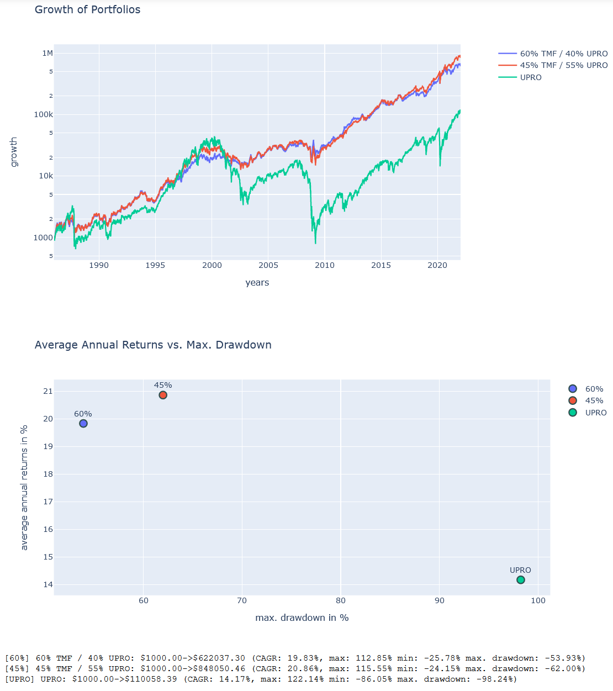

Wir sehen regelrecht, wie sich in diesem Zeitraum fast alles umdreht: Bei der Dot-Com Bubble und der anschließenden Finanzkrise sind Aktien so hart eingebrochen, dass der UPRO es bis heute nicht geschafft hat wieder aufzuholen (die Pfadabhängigkeit lässt grüßen), und dass obwohl Aktien in den letzten 10 Jahren genauso massiv gewachsen sind wie von 1950 bis 1965. Dafür haben aber Anleihen aufgrund der sinkenden Zinsen echt einen Bullenlauf hingelegt und die HFEA Portfolios so richtig angehoben. Auch hier stellt das verbesserte HFEA Portfolio mit 45% TMF und 55% UPRO das Optimum gegenüber der Originalaufteilung dar und erreicht sogar ein CAGR von fast 21%. Das Risiko ist mit einem max. Einbruch von 62% sogar noch geringer als in den Jahren von 1943 bis 1985.

Schauen wir uns jetzt mal den gesamten Zeitraum an:

&#x200B;

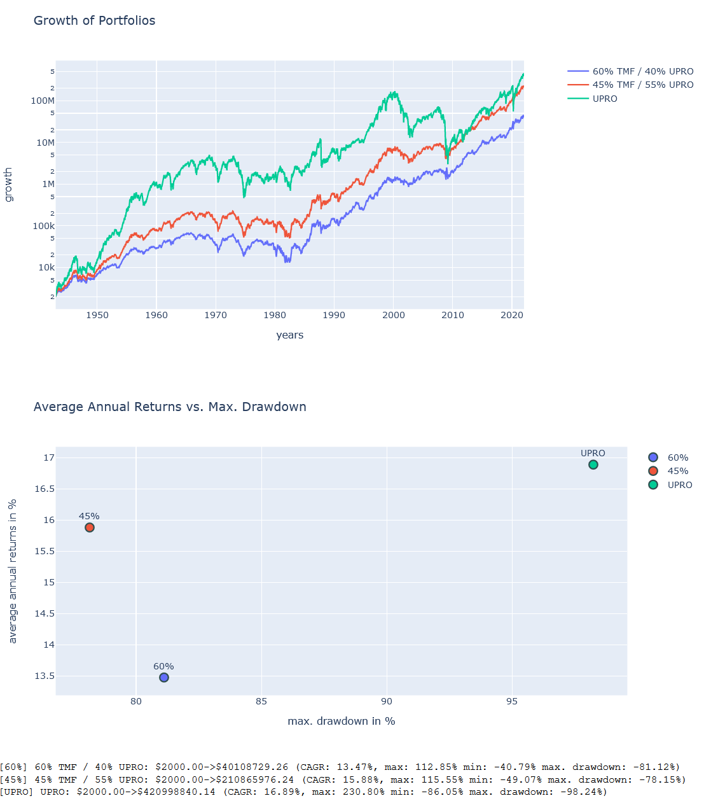

Wie ihr seht, wäre der UPRO in den 50er Jahren so massiv gewachsen, dass ihn selbst die Dot-Com Bubble und Finanzkrise nichts anhaben konnten. Er wäre immer noch der Spitzenreiter. Aber mit 98% maximalen Einbruch ist das auch eine tickende Zeitbombe im Portfolio. Dagegen erreicht das 45% HFEA Portfolio ein CAGR von 15.9% bei einem Einbruch von „nur“ 78%. Hätte man im Jahr 1943 $2000 in dieses Portfolio gelegt, wären das jetzt über $40.000.000. Glückwunsch an alle, die so weitsichtige Urgroßeltern hatten. Bei allen weiteren Analysen werden wir nur noch die 45% TMF und 55% UPRO Aufteilung als **"HFEA"** bezeichnen, da diese in allen Zeitabschnitten gegenüber der ursprünglichen Aufteilung überlegen ist.

## Untersuchung unterschiedlicher Hebel beim HFEA Portfolio

Das HFEA Portfolio ist ein sogenanntes Risk-Parity Portfolio, bei welchem die Risiken zwischen zwei Positionen (Aktien und Anleihen) aufgeteilt werden. Das ist jetzt keine allzu neue Idee. Das Interessante an dieser Idee war eben die Einführung der 3er Hebel, womit man offensichtlich das CAGR, aber auch das Risiko deutlich steigern kann. Schauen wir uns nun mal an, wie sich die gleiche 55% Aktien und 45% Anleihen Aufteilung bei unterschiedlichen Hebeln verhält. In der nächsten Grafik werden die Portfolios anhand ihrer Hebel benannt. Der erste Hebel ist der für Aktien und der zweite der für Anleihen: 3x/2x ist also ein Portfolio mit 55% 3x S&P 500 und 45% 2x LTT.

&#x200B;

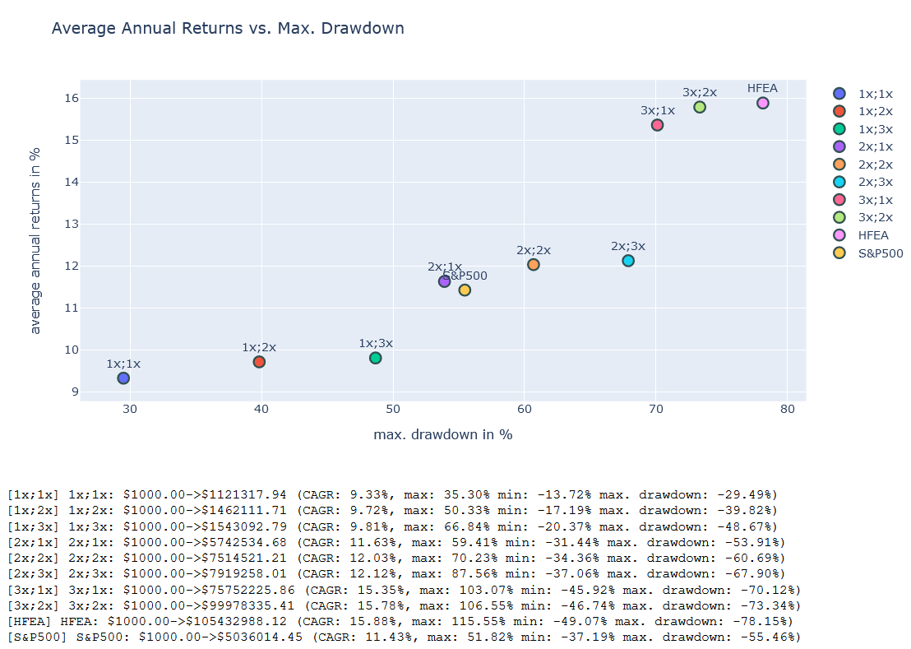

Ein klassisches Risk-Parity Portfolio ist das 1x/1x Portfolio. Es erreicht ein CAGR von 9.3% und einen maximalen Einbruch von unter 30%. Es ist damit ziemlich Risikoarm. Ein solches Protfolio performt auch deutlich schlechter als der S&P 500 allgemein. Interessanterweise erhöht man mit einem Hebel auf die LTTs eigentlich nur das Risiko signifikant. Das CAGR kann zwar ganz leicht angehoben werden, aber ob man nun 9.3% und 9.8% CAGR hat ist auch egal.

Erst durch die Erhöhung des Hebels bei den Aktien auf 2, können wir den S&P 500 leicht ausperformen. Das Risiko ist dabei etwas geringer. Aber auch hier bringt die Erhöhung des Hebels auf LTTs keinen weiteren Fortschritt beim CAGR und erhöht nur das Risiko.

Das gleiche Spiel sehen wir dann bei einem 3x Hebel auf Aktien: Wir erreichen nun mit 15.3% CAGR fast das Niveau von HFEA, aber haben 8% weniger maximalen Einbruch als Risiko. Eine Erhöhung des Hebels bei den Anleihen kann auch hier wieder das CAGR leicht erhöhen, aber eben auch das Risiko.

Aus diesem Grund benennen wir an dieser Stelle das erste Mal eine alternative HFEA Strategie, welche einen 3x Hebel auf S&P 500 benutzt, aber nur einen 1x Hebel auf LTTs. In allen fortlaufendenden Vergleichen wird dieses Portfolio als **"HFEA-"** bezeichnet.

Auf Wunsch von u/what_the_actual_luck füge ich in alle folgenden Vergleiche auch ein klassisches Risk-Parity-Portfolio mit 60% Anleihen und 40% Aktien (ohne Hebel) ein. Dieses trägt den Namen **„P“**.

## Risk-Parity Portfolios in Europa

Als ersten Schritt zu einem europäischen HFEA Portfolio, sehen wir uns zunächst verschiedene Akien-/Anleihen-Aufteilungen bei europäischen ETFs an. Alles erstmal ohne Hebel. Wir suchen uns dann ein paar interessante Aufteilungen heraus und fügen dann einen Hebel hinzu. In der folgenden Grafik wurde die Aufteilung zwischen Aktien und Anleihen von 0% (alles Anleihen) bis 100% (alles Aktien) in 5%-Schritten erhöht:

&#x200B;

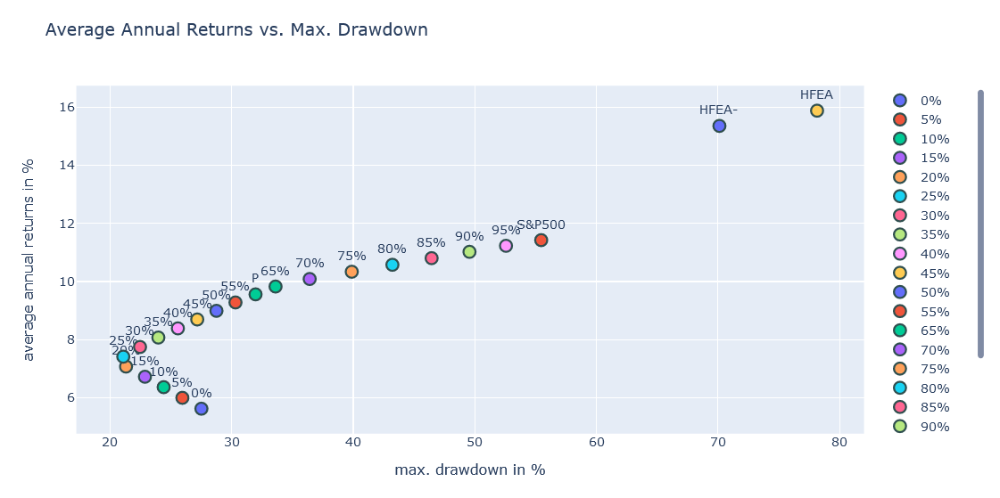

Natürlich sind die HFEA Strategien weit weg, da wir hier ja noch keine Hebel verwenden. Wir sehen aber auch, dass keine Aufteilung (außer 100% Aktien) in der Lage ist eine S&P 500 Buy and Hold-Strategie zu schlagen. Das bedeutet, dass der positive Effekt aus dem Rebalancing, ohne die Einführung eines Hebels, nicht ausreicht um besser als der US-Aktienmarkt zu performen.

Interessant ist aber die Pfeilform im Gewinn/Risikodiagramm: Es scheint, bezogen auf das Risiko, eine optimale Aufteilung zugeben, welche das Risiko minimiert. Diese liegt bei ca. 25% bei der Risikometrik, welche ich hier verwende (max. Einbruch). Allerdings ist bei 25% das CAGR auch unterhalb von 8%.

Für unsere weitere Untersuchung nehmen wir uns die Aufteilung 50%, 65% und 80% heraus. Das heißt: Jedes Mal, wenn ein Portfolio mit **„50%“** bezeichnet wurde handelt es sich um eines mit 50% Aktien und 50% Anleihen. Das gleiche gilt dann analog dazu für **„65%“** und **„80%“**.

## Das 50% Portfolio mit Hebeln:

Fügen wir nun unterschiedliche Hebel in das 50% Portfolio ein. Die Hebel 1x und 2x bei Aktien beziehen sich auf S&P 500 ETFs. Der 3x Hebel ist dann der S&P 500 ETN vom Weisheitsbaum. Bei den Anleihen ist der 1x Hebel der LTT ETF und der 3x Hebel der ITT ETN vom Weisheitsbaum. Einen 2x Hebel auf US-Anleihen gibt es in Europa nicht.

&#x200B;

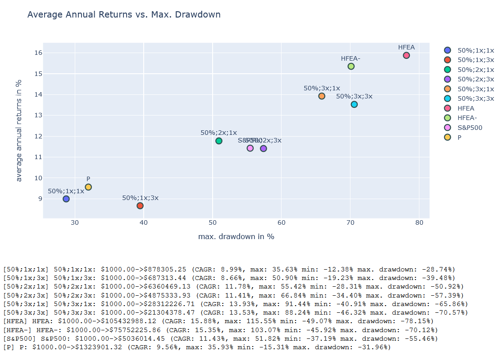

Wie schon bei der Untersuchung der HFEA Hebel sehen wir auch hier, dass erst ab einem 2x Hebel für Aktien der S&P 500 (ungehebelt) geschlagen werden kann. Dafür ist das Risiko dann ca. 5% geringer. Mit einem 3x Hebel kommen wir zumindest in die Nähe vom HFEA- Portfolio. Unser Risiko ist dann immer noch geringer, aber wir erreichen eben auch nur eine CAGR von 14% anstatt 15.3%.

Die Einführung eines Hebels bei den Anleihen (3x ITT) hingegen bringt in keinem Fall einen Vorteil: Es sinkt sogar das CAGR ab und hebt nur das Risiko an. Es ist davon auszugehen, dass wir durch eine weitere Erhöhung des Aktienanteils näher an HFEA herankommen. Daher nehmen wir für die 50% Aufteilung nur die Hebel 2x/1x (2x S&P 500, 1x LTT) heraus und merken uns dieses Portfolio.

## Das 65% Portfolio mit Hebeln:

Jetzt führen wir das ganze Experiment noch einmal mit dem 65% Portfolio durch:

&#x200B;

Beim 65% Portfolio kann ein Hebel von 2 bei den Aktien schon deutlich den S&P 500 ausperformen. Allerdings steigt dadurch das Risiko auch schon ordentlich an. Ein 65% Portfolio mit 3x Hebel kommt dagegen sehr dicht an HFEA heran, schafft aber nicht ganz das gleiche CAGR. Der Grund hierfür sind die hohen Kosten der Weisheitsbaum ETNs. Man muss auch bedenken, dass ETNs ein zusätzliches Emittentenrisiko besitzen, was bei ETFs (also bis maximal 2er Hebel) nicht der Fall ist.

Weiterhin ist hier interessant, dass bei allen Aktienhebeln unter 3 ein Hebel bei den Anleihen nur das Risiko erhöht. Lediglich bei einem Aktienhebel von 3, dreht sich dieser Effekt um: Hier ist das Portfolio mit einem 3er Hebel auf Aktien und 3er Hebel auf ITTs risikoärmer als mit ungehebelten LTTs.

Die für weitere Untersuchung interessanten Portfolios ist das 2x/1x Portfolio und das 3x/3x Portfolio.

## Das 80% Portfolio mit Hebeln

&#x200B;

Beim 80% Portfolio kommt schon ein 2er Hebel mit einem CAGR von 14% in die Nähe von HFEA. Ein 3er Hebel erreicht fast das gleiche CAGR von HFEA, hat dafür jedoch ein wesentlich höheres Risiko, so dass wir uns hier nicht weiter darum kümmern.

Auch beim Hebel der Anleihen sehen wir einen ähnlichen Effekt wie bei beim 65% Portfolio: Während ein Hebel auf Anleihen bei einem Aktienhebel unter 3 nur das Risiko erhöht, ohne einen positiven Effekt auf das CAGR zu haben, führt ein Aktienhebel von 3 dazu, dass plötzlich das Portfolio mit dem 3er Hebel auf ITTs leicht Risikoärmer wird.

Das einzig interessante Portfolio aus dieser Testreihe ist das 2x/1x Portfolio, welches wir weiter untersuchen werden.

## Abschließende Untersuchung

Schauen wir uns am Ende noch einmal die von uns ausgewählten Portfolios an und versuchen diese zu charakterisieren:

&#x200B;

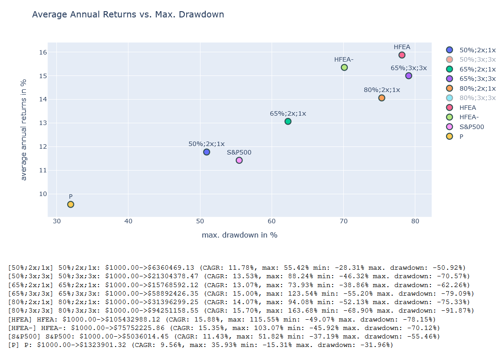

Im Grunde genommen können wir folgende Schlüsse ziehen:

* Das HFEA bzw. HFEA- Portfolio mit US ETFs hat deutlich die beste Performance
* Lediglich das 65% Portfolio mit 3x S&P 500 / 3x ITT ETNs kommt in die Nähe von HFEA und verhält sich beim Risiko auch ähnlich. Allerdings hat ein solches Portfolio das Risiko eines Emittentenausfalls.
* Wenn man lieber lediglich auf europäische ETFs setzen möchte, kommt man mit 80% Aktien und 20% Anleihen am ehesten ran.
* Deutlich risikoärmer ist allerdings das 65% Portfolio mit 2x S&P 500 und 1x LTT ETFs. Dieses kann den S&P 500 gut ausperformen und hat weniger Risiko als HFEA.
* Noch Risikoärmer ist das 50% Portfolio mit 2x S&P 500 und 1x LTT ETFs. Dieses kann jedoch nur knapp den S&P 500 ausperformen, ist dafür aber weniger Risikoreich als Buy and Hold.

Interessant ist bei der Betrachtung dieser Portfolios, dass zwischen dem 50% und 65% Portfolio sich der Zeitpunkt des größten Einbruchs ändert: Das 50% Portfolio ist (wegen dem hohen Anleihe Anteil) am schlimmsten von 1972 bis 1974 eingebrochen:

&#x200B;

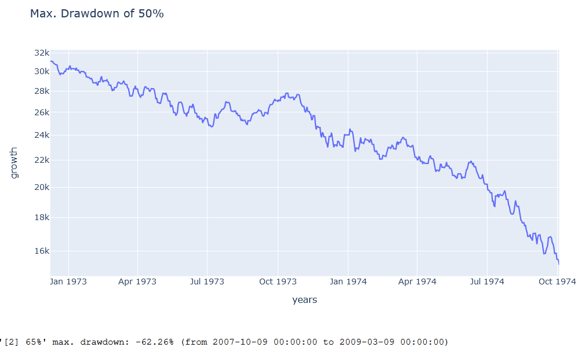

Das 65% Portfolio und alle weiteren Portfolios sind hingegen am schlimmsten während der Dot-Com Bubble und der Finanzkrise eingebrochen. Also von 2000 bis 2009:

&#x200B;

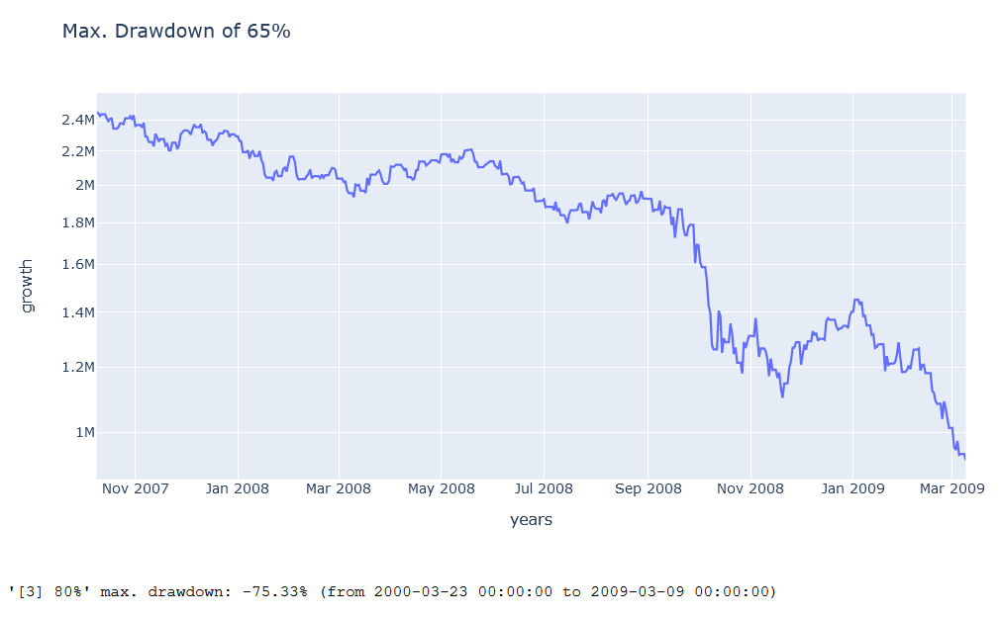

Auch bei der Worst-Case Analyse können wir deutliche Unterschiede zwischen den Portfolios erkennen. Bei dieser Analyse nehme ich an, dass ihr zum schlimmsten möglichen Zeitpunkt seit 1943 einen hohen Betrag investiert habt und diesen dann exakt X Jahre haltet. Die Frage ist dann: was ist die minimale Rendite in Abhängigkeit von der Anzahl der Jahre.

&#x200B;

Das 50% Portfolio ist etwa 1 Jahr früher Brechgleich als eine S&P 500 Buy and Hold Strategie. Je höher der Aktienanteil wird, desto länger dauert es um Brechgleich zu erreichen. Bei HFEA sind es schon stolze 27 Jahre. Aber bei dieser Worst Case Analyse erreicht kein Portfolio nach 30 Jahren die minimale jährliche Rendite vom S&P 500. Wohlgemerkt: Nur dann, wenn man wirklich zum schlimmsten möglichen Zeitpunkt investiert, also direkt beim Allzeithoch bevor eine neue Krise startet.

Im Übrigen verbessert sich diese Situation bei HFEA deutlich, wenn man den Hebel bei den LTTs weg lässt:

&#x200B;

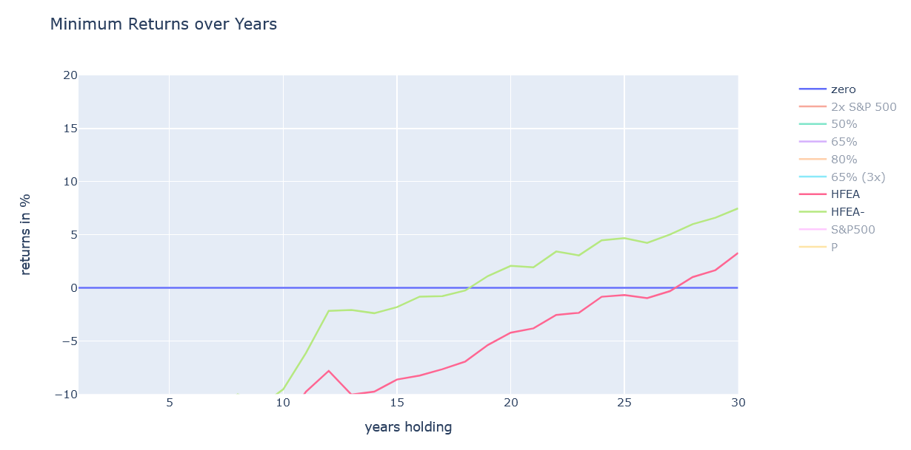

Ein solchen Portfolio wäre schon nach 19 Jahren Brechgleich und erreicht nach 30 Jahren den gleichen minimalen jährlichen Gewinn wie die anderen europäischen Portfolios. Damit ist die HFEA- Strategie durchaus eine Überlegung wert. Außerdem zeigt es, dass gerade der Hebel bei den Bonds deutlich zum Risiko bei HFEA beiträgt.

## Fazit

Wir haben uns verschiedene Aufteilungen zwischen Aktien- und Anleihen-ETNs angesehen und einige Aufteilungen identifiziert, welche interessant erscheinen. Im Anschluss testeten wir mit diesen Aufteilungen verschiedene Hebel aus und stellten dabei fest, dass kein europäisches Portfolio an die Performance von HFEA herankommt.

Dennoch identifizierten wir mehrere Portfolios, welche eine interessante Performance/Risiko-Konstellation bieten. Diese Portfolios dienen uns für weitere Tests als Grundlage.

Für alle weiteren Teile dieser DD-Serie definiere ich damit 6 verschiedene Vergleichsportfolios:

* US-ETFs:
   * **HFEA**: 55% UPRO / 45% TMF
   * **HFEA-**: 55% UPRO / 45% TLT (1x LTT)
* EU-ETFs/ETNs:
   * Hohes Risiko:
      * **80%**: 80% 2x S&P 500 / 20% 1x LTT (Europa)
      * **65% (3x)**: 65% 3x S&P 500 / 35% 3x ITT (Europa)
   * Mittleres Risiko:
      * **65%**: 65% 2x S&P 500 / 35% 1x LTT (Europa)
   * Geringes Risiko:
      * **50%**: 50% 2x S&P 500 / 50% 1x LTT (Europa)

Im nächsten Teil werden wir mal testweise noch Gold oder eine Cash-Reserve in unsere Portfolios hineinmischen. Eventuell kommen wir damit dann doch besser durch eine Krise. Wie immer findet ihr den Code und alle Daten im Repository \[2\] und falls ihr Wünsche bezüglich besonderer Analysen und Backtests habt, schreibt mir diese in die Kommentare.

Im Übrigen hat mich u/what_the_actual_luck gestern auf einen Artikel \[3\] aufmerksam gemacht, welches eine ähnliche Analyse auf Monte-Carlo Basis mit simulierten US-ETFs und mit Daten ab 1989 durchgeführt hat. Die Ergebnisse sind im Großen und Ganzen gleich wie bei mir.

## Fragen

Dieser Frage bin ich auch mal nachgegangen. Schauen wir uns zunächst mal an, wie sich unsere Strategien verhalten, wenn wir anstatt LTTs die ITTs nehmen, aber den Hebel gleich lassen:

&#x200B;

Grundsätzlich führt die Verwendung von ITTs ganz offensichtlich zu einem schlechteren Ergebnis. Sowohl bei dem CAGR als auch beim Risiko. Aber vielleicht ändert sich das, wenn man einen 3x ITT ETN verwendet und dazu halt ein paar Prozent 1x LTT nimmt? Hierzu habe ich mal das 50% Portfolio mit verschiedenen Aufteilungen zwischen 1x LTT und 3x ITT getestet. In der folgenden Grafik bedeutet 100%, dass 100% LTTs verwendet wurden und 0% ITTs. Dagegen bedeutet 0%, dass 0% LTTs aber 100% ITTs (3er Hebel) verwendet wurden:

&#x200B;

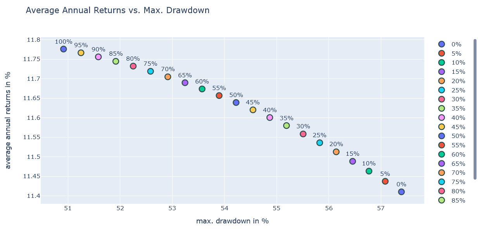

Wie man sieht ist das Ergebnis eindeutig: ITTs, selbst mit Hebel und egal in welcher Aufteilung verschlechtern das Ergebnis. Das gilt auch für das 65% Portfolio, allerdings ist es im Detail etwas anders:

&#x200B;

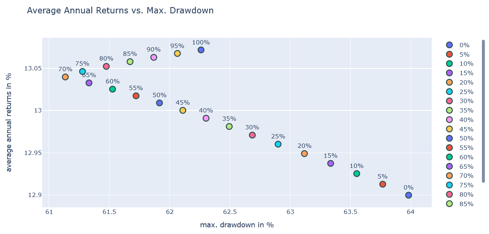

Das Einführen von 3er ITTs verringert zwar immer die Performance, aber kann bis zu 30% ITTs (also 70% LTTs) auch das Risiko leicht verringern. Allerdings nur sehr leicht (man beachte die Skalierung der X-Achse). Erst wenn wir für die Aktien auch einen 3x ETN verwenden erhalten wir exakt das gegenteilige Ergebnis:

&#x200B;

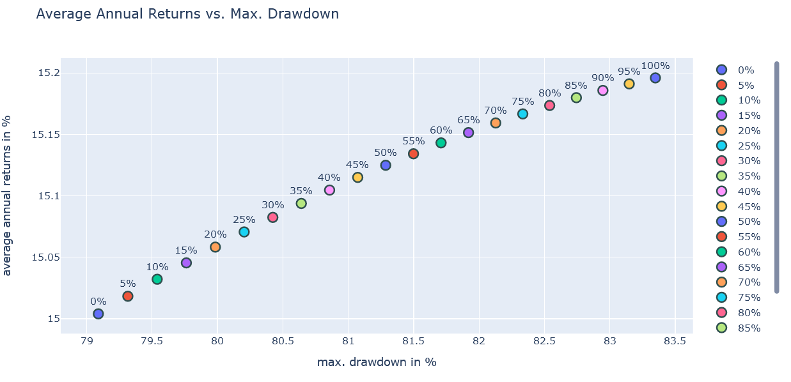

Hier erhöht die Verwendung von 3er ITTs durchgängig die Performance, aber auch leicht das Risiko. Das hatten wir schon weiter oben gesehen, weswegen wir das 65% Portfolio einmal in der 2x/1x Variante und dann in der 3x/3x Variante auserkoren haben.

## Zugabe

Unser Breh u/ganbaro hat beim letzten oder vorletzten Teil den Vorschlag gemacht, dass ich die zeitlich veränderte Korrelation zwischen Aktien und Anleihen mal in Abhängigkeit von den Aktiengewinnen im gleichen Zeitraum darstelle. Die Hoffnung ist hier, dass die Korrelation zwischen beiden nur dann positiv wird, wenn Aktien gut performen.

Hierzu habe ich die Korrelation immer auf Basis von 5 Jahren zwischen Aktien und Anleihen berechnet und dieses 5-jahres Fenster dann jeweils einen Monat verschoben und neu berechnet. Außerdem errechnete ich auch die CAGR vom S&P 500 innerhalb der 5 Jahre und merkte mir beide errechneten Werte. Die folgenden Diagramme stellen diese Werte dar:

&#x200B;

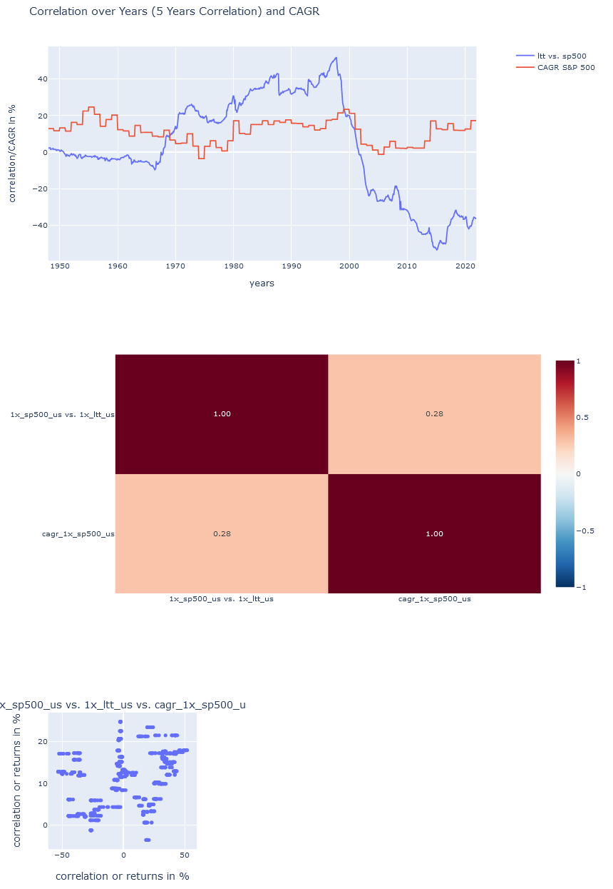

Wenn die Vermutung stimmen würde, müssten wir im Scatterplott viele Punkte in der rechten oberen Hälfte sehen. Also immer dann eine starke Korrelation existieren, wenn das CAGR hoch ist. Hier gibt es tatsächlich ein kleines Cluster in der oberen rechten Ecke, welches links nicht existiert. Allerdings reichen die Werte auf der rechten Hälfte auch sehr weit nach unten, also in den Bereich geringer CAGR. Daher würde ich sagen, dass es keinen nennenswerten Zusammenhang zwischen CAGR und Korrelation von Aktien und Anleihen gibt.

## Quellen

\[1\] [https://www.bogleheads.org/forum/viewtopic.php?f=10&t=272007](https://www.bogleheads.org/forum/viewtopic.php?f=10&t=272007)

\[2\] [https://code.launchpad.net/zgea](https://code.launchpad.net/zgea)

\[3\] [https://arxiv.org/abs/2103.10157](https://arxiv.org/abs/2103.10157)
