# Verbessert Gold oder Cash die HFEA Strategie?

**ZL;NG**

* *Bis zu 25% Gold im Hedgeanteil des Portfolios könnte eine gute Idee sein, wenn man davon ausgeht, dass wir wieder Jahre hoher und anhaltender Inflation sehen.*
* *Ein HFEA Portfolio mit Gold performt bei gleichem Risiko besser als HFEA mit nur ungehebelten Schatzkisten (HFEA-).*
* *Jegliche Menge von Cash im Hedgeanteil ist hingegen immer eine schlechte Idee.*

Liebe Schwestern und Brüder der Mauerstraße,

letzte Woche schauten wir uns die HFEA Strategie und deren mögliche Umsetzung mit europäischen ETFs an. In diesem Teil wollen wir uns überlegen, ob man die Strategie verbessern kann. Hierbei werden wir zunächst den Hedgeanteil untersuchen. Wir haben ja bereits im Teil 4 gesehen, dass die gehebelten LTTs in der Energiekrise und Stagflationsphase der 70er und 80er Jahre sehr gelitten haben. Also stellt sich die Frage, ob wir daran etwas verbessern können?

Eine Möglichkeit um darauf zu antworten, fanden wir bereits im letzten Teil mit der HFEA- Strategie, welche nur ungehebelte LTTs verwendet. Heute prüfen wir dagegen, ob man durch das Einmischen von Gold oder das halten von Cash das Risiko eventuell weiter verringern kann.

## Verbessert Gold oder Cash die HFEA Strategie?

## Vergleichsportfolios

Schauen wir uns ganz zum Anfang noch einmal die Portfolios an, welche wir im letzten Teil erarbeitet hatten. Ganz grob können wir diese nach US- und EU-Portfolios unterteilen, wobei die einen Portfolios nur US-ETFs halten und die anderen Portfolios nur EU-ETFs/ETNs. Anschließend unterteilen wir die EU-Portfolios in hohes, mittleres und geringes Risiko (entsprechend unserer Risikometrik – den maximalen finanziellen Verlust bei einer Krise).

* US-Portfolios:
   * **HFEA:** 55% UPRO / 45% TMF
   * **HFEA-**: 55% UPRO / 45% TLT (1x LTT)

&#x200B;

* EU-Portfolios:
   * Hohes Risiko:
      * **80%**: 80% 2x S&P 500 / 20% 1x LTT (Europa)
      * **65% (3x)**: 65% 3x S&P 500 / 35% 3x ITT (Europa)
   * Mittleres Risiko:
      * **65%**: 65% 2x S&P 500 / 35% 1x LTT (Europa)
   * Geringes Risiko:
      * **50%**: 50% 2x S&P 500 / 50% 1x LTT (Europa)

In allen nachfolgenden Grafiken werden die Portfolios entsprechend dieser Liste abgekürzt. Also „**50%**“ steht dann für 50% 2x S&P 500 + 50% 1x LTT. Die „**65% (3x)**“ ist dann das 65% 3x S&P 500 + 35% 3x ITT Portfolio usw.

Zusätzlich simulieren wir dann auch immer noch ein Portfolio, welches ganz aus S&P 500 besteht (es trägt den Namen „S&P500“, sowie ein klassisches Risk-Parity Portfolio mit 60% 1x S&P 500 und 40% 1x LTT, welchen den Namen „P“ besitzt. Je nachdem wie stark in den Grafiken hereingezoomt werden muss, um etwas zu erkennen, sind diese Bezeichnungen darin zu sehen oder nicht.

Alle Backtests werden von 1943 an bis Ende 2021 berechnet. Erst in einem folgen Teil gucken wir uns die unterschiedlichen Portfolios in gezielt ausgesuchten Szenarien an, wo wir dann den Backtest über andere Zeiträume laufen lassen.

## Gold im Hedgeanteil

Schon im Teil 3 und 4 mussten wir feststellen, dass Gold eine ziemlich miese Performance hat. Nach dem Zusammenbruch des Bretton-Woods-Systems in den 1970er Jahren hat Gold extrem an Wert gewonnen, dann aber leider ab den 1980er Jahren auch wieder stark verloren. Erst nach der Dot-Com-Bubble ist Gold eigentlich wieder im Kommen, wobei die Wachstumsraten eher vernachlässigbar sind:

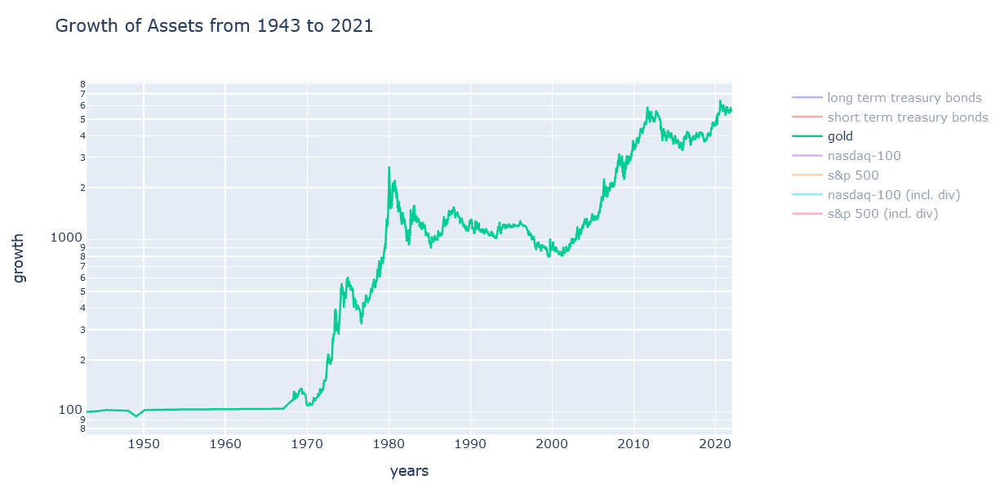

Eines der Probleme ist, dass auch exakt in die Zeit des Zusammenbruchs vom Bretton-Woods-System, die Zeit der hohen Inflation fällt. Damit können wir im Nachhinein nur schwer sagen, ob Gold wegen dem Zusammenbruch oder wegen der hohen Inflation so stark gewachsen ist. Das muss jeder von euch selbst entscheiden, wenn es um die Frage geht, ob Gold in den kommenden Jahren (bei einer weiterhin hohen Inflation) noch einmal einen solchen Wachstum hinlegen könnte.

So, jetzt habe ich hier genug Binsenweisheiten von mir gegeben, schauen wir uns stattdessen mal an wie sich das **50%** Portfolio verhält, wenn wir etwas Gold hinzugeben. Die folgende Grafik stellt den Gewinn dem Risiko gegenüber. Hierbei ist der Gewinn als CAGR in Prozent definiert und das Risiko als der maximalen finanziellen Verluste des Portfolios (bei einer Krise) in Prozent. Wir simulieren hier verschiedene **50%** Portfolios, wobei wir in 10% Schritten den Anteil von Gold im Hedge erhöhen. Die Prozentzahl bezieht sich also immer nur auf den Hedgeanteil. Damit würde ein 50% Gold Portfolio aus 50% 2x S&P 500 sowie 25% 1x LTT und 25% 1x Gold bestehen.

&#x200B;

Wir können gut erkennen, dass schon das minimale hinzugeben von Gold das Risiko deutlich reduzieren kann. Bei kleinen Mengen an Gold wächst sogar der Gewinn ganz leicht an. Ein Optimum wäre hier wohl im Bereich von 20%-30%. Ab 50% Gold nimmt der Gewinn stark ab und das Risiko steigt an. Ein Hedge, der 100% aus Gold besteht, würde dann ein höheres Risiko haben als 100% LTTs und eine geringere CAGR besitzen.

In diesem Zusammenhang ist es wichtig zu verstehen, dass die Risikometrik nicht linear ist. Es wird ja hierfür geschaut, wo innerhalb der letzten 80 Jahre der stärkste Einbruch beim Portfolio stattfand. Wenn wir etwas Gold hinzugeben, kann es passieren dann, dass der stärkste Einbruch dann eben zu einer ganz anderen Zeit, und mit einer ganz anderen Charakteristik stattfindet. Zur Verdeutlichung habe ich hier zwei Grafiken für euch. Die erste zeigt den schlimmsten Einbruch des **50%** Portfolios ohne Gold. Dieser geschah zwischen 1972 bis 1974 und betrug ca. 51%:

&#x200B;

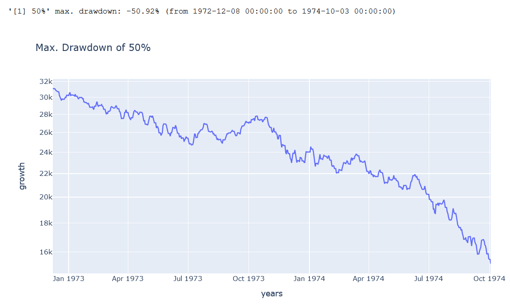

Geben wir 25% Gold in den Hedge des Portfolios hinein, haben wir danach den schlimmsten Einbruch von 2007 bis 2009 mit nur noch 49%:

&#x200B;

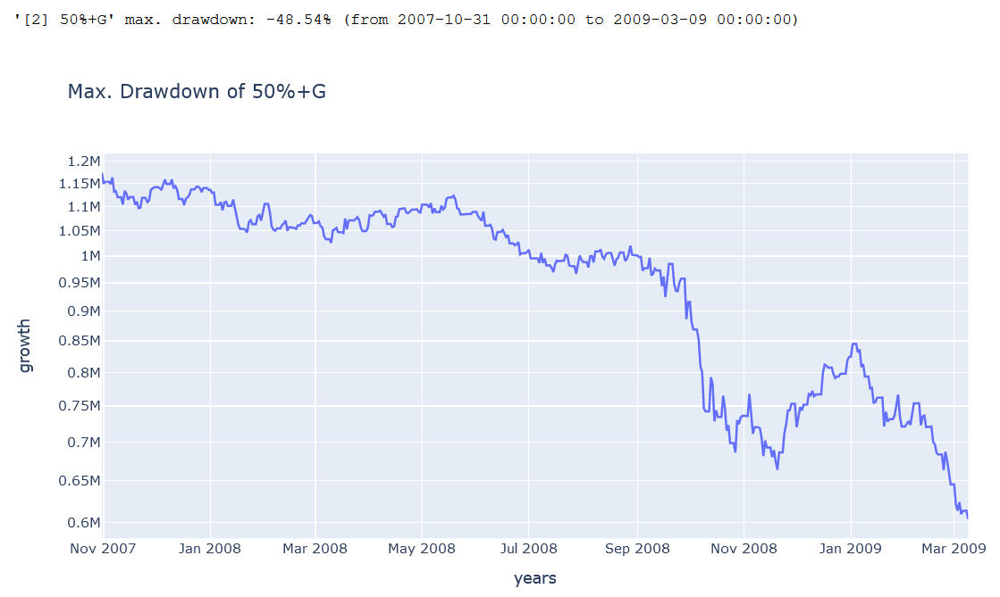

Das erklärt auch die zum Teil starken Sprünge bei nur kleinen Änderungen innerhalb der Risikometrik. Für das **50%** Portfolio können wir aber zusammenfassen, dass sich 20%-30% innerhalb des Hedges als günstig erweisen würde. Wir definieren nun dieses Portfolio für die weitere Diskussion einfach unter den Namen „**50%+G**“.

Den gleichen Test können wir jetzt für das **65%** Portfolio durchführen:

&#x200B;

Der Unterschied ist hier gar nicht mehr so groß wie bei den **50%** Portfolio. Wir müssen schon deutlich heran zoomen um die Unterschiede zu sehen. Es scheint so, dass eine kleine Menge Gold die Performance minimal anhebt, aber wird die Menge zu groß, steigt auch stark das Risiko. Also maximal 30% wären hier wohl noch akzeptabel. Wir können daher erneut 25% auswählen und das entsprechende Portfolio als „**65%+G**“ bezeichnen.

Als nächstes schauen wir uns das **80%** Portfolio an:

&#x200B;

Auch hier musste wieder massiv herangezoomt werden um überhaupt einen Unterschied zu erkennen. Offensichtlich sinkt mit Gold im Portfolio etwas das Risiko. Bis 30% gibt es kaum Unterschiede in der Performance, aber da drüber hinaus sinkt diese ebenfalls stärker ab. Daher fällt es leicht auch hier das „**80%+G**“ Portfolio mit 25% Gold im Hedgeanteil zu definieren.

Dann ist das **65% (3x)** Portfolio an der Reihe:

&#x200B;

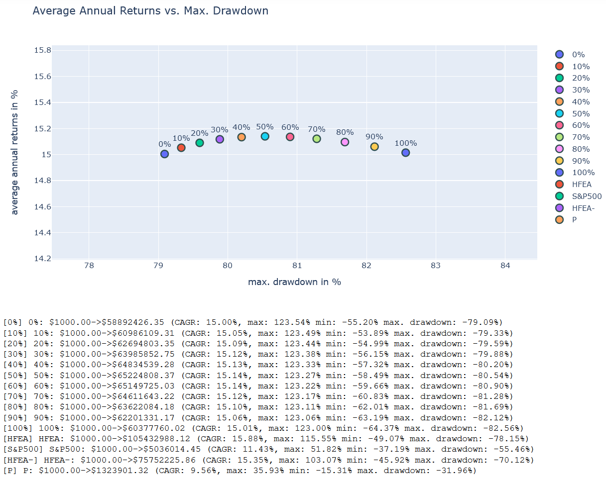

Auch hier erhöht Gold das Risiko, aber auch etwas die Performance. Daher wären hier 25% noch ein guter Kompromiss zwischen einer nur Geringfügigen Risikoerhöhung, dafür mehr Diversifikation und ganz leicht mehr Performance.

Nun kommen wir zu dem **HFEA** Portfolio:

&#x200B;

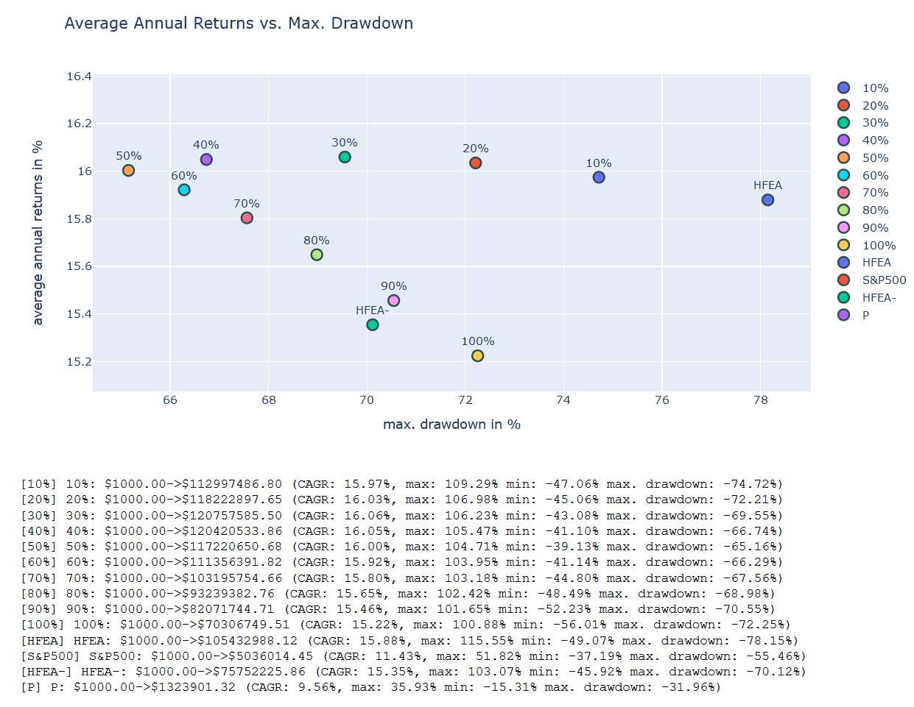

Hier sehen wir endlich einen wirklich starken Unterschied: Gold hebt offensichtlich genau die Schwächen des 3x gehebelten LTT Anteils im Portfolio auf. Mit bis zu 50% Gold im Hedge-Anteil hat man eine leicht bessere Performance und deutlich weniger Risiko. Danach kippt das Risiko und nimmt wieder zu, bei gleichzeitig sinkender Performance. Schauen wir uns doch mal an, wo sich das Gold eigentlich im zeitlichen Verlauf des Portfoliowachstums bemerkbar macht. Die folgende Grafik stellt das Wachstum vom HFEA und HFEA mit 50% Gold im Hedge gegenüber.

&#x200B;

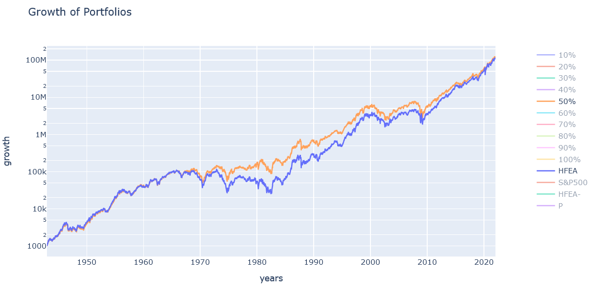

Wir sehen klar, dass es sich eigentlich nur um die 70er und 80er Jahre handelt, in welchen das Goldportfolio so gut performt. Wählt man also einen hohen Goldanteil im Hedge aus, dann macht man das unter der Annahme, dass wir wieder so eine Situation erleben werden. Tritt dies nicht ein, dann wäre die Performance deutlich schlechter. Aus diesem Grund würde ich davon abraten den Goldanteil zu hoch zu wählen. Ich denke, dass ein Anteil von 25% im Hedge ein guter Wert wäre, der im Backtest zu einem ähnlichen Risiko wie **HFEA-** führt und dabei gleichzeitig eine ähnliche Performance wie **HFEA** besitzt. Außerdem erhöht das etwas die Diversifikation des Portfolios. Wir definieren dieses Portfolio dann als „**HFEA+G**“.

Zu guter Letzt schauen wir mal auf das **HFEA-** Portfolio.

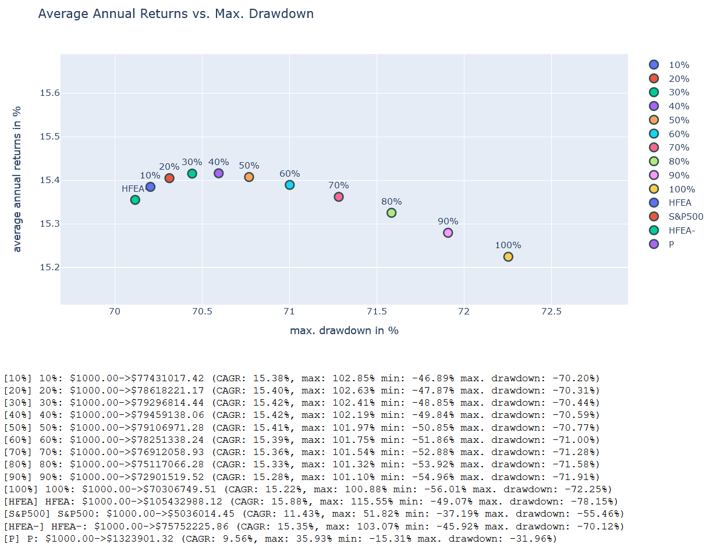

Das **HFEA-** Portfolio profitiert deutlich weniger vom Gold. Zwar steigt bis etwa 35% die Performance ganz leicht an, aber auch das Risiko wird dabei größer. Der Grund, warum Gold im HFEA Portfolio so viel bringt ist die Tatsache, dass es exakt in den 70er und 80er Jahren, in welchen die 3x gehebelten LTTs unglaublich schlechte Performance zeigen, Gold eine gute Performance hat. Wenn wir jedoch nur 1x gehebelte LTTs verwenden, zeigt sich hier der Vorteil von Gold nicht mehr so stark.

Man könnte hier auch – der Konsistenz zuliebe – maximal 25% Gold in den Hedge hineinnahmen und damit das „HFEA-+G“ Portfolio definieren. Allerdings stellt sich wirklich die Frage, ob das überhaupt noch Sinn macht. Das **HFEA-** Portfolio richtet sich an die Leute, die glauben, dass es wieder eine Zeit hoher und langanhaltender Inflation geben wird. Wenn man diese Annahme hat, dann wäre aber **HFEA+G** die bessere Wahl. Und wenn nicht, dann nimmt man halt gleich lieber HFEA ohne Gold. Somit ist **HFEA+G** und **HFEA-** schon redundant und das gleiche gilt dann erst recht für HFEA-+G. Aus diesem Grund werde ich für alle weiteren Teile dieser DD Serie das **HFEA-** Portfolio nicht mehr weiter berücksichtigen.

## Aber was ist denn mit Cash im Hedge?

Eine Frage wurde in den letzten Teilen immer wieder gestellt: Was wäre, wenn man anstatt ausschließlich gehebelter Anleihen auch etwas Cash im Hedge hätte? Schauen wir uns nun noch einmal alle Portfolios an, nur dass wir anstatt Gold einen Cash Anteil hinzunehmen. Fangen wir erneut mit den **50%** Portfolio an:

&#x200B;

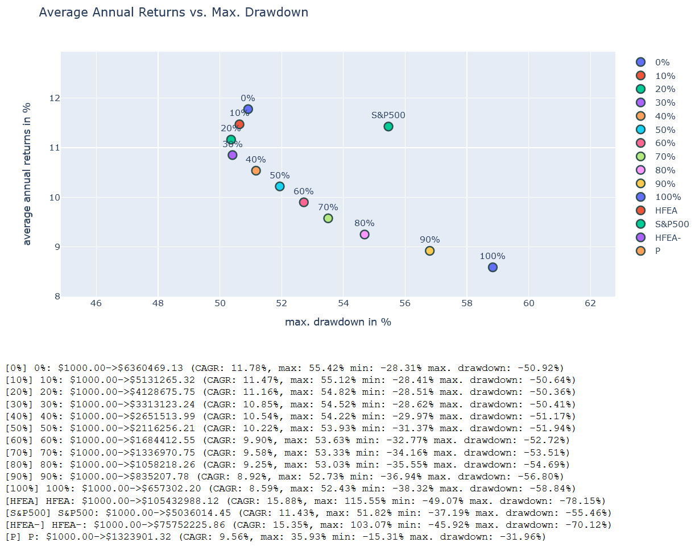

Tja, wenn man es positiv formuliert, könnte man sagen, dass bis zu 20% Cash hier das Risiko geringfügig besser wird. Dafür sinkt dann die Performance auf ein Niveau unter einer S&P 500 Buy and Hold-Strategie. Es ist daher nicht sinnvoll Cash im **50%** Portfolio zu besitzen.

Gucken wir uns das mal bei dem **65%** Portfolio an:

&#x200B;

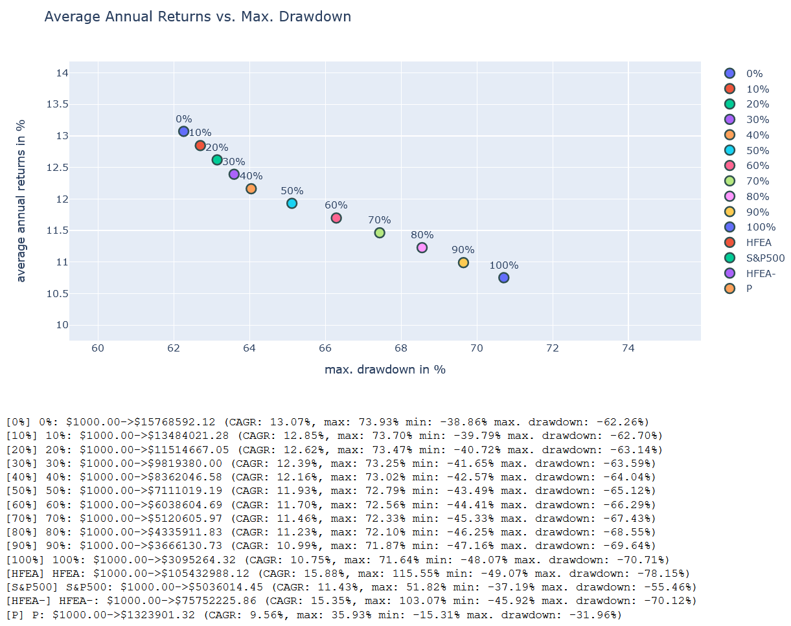

Hier wird es noch schlimmer: Schon kleine Mengen Cash verringern deutlich die Performance und erhöhen zudem das Risiko. Wer würde so etwas machen wollen?

Nun kommt das **80%** Portfolio:

&#x200B;

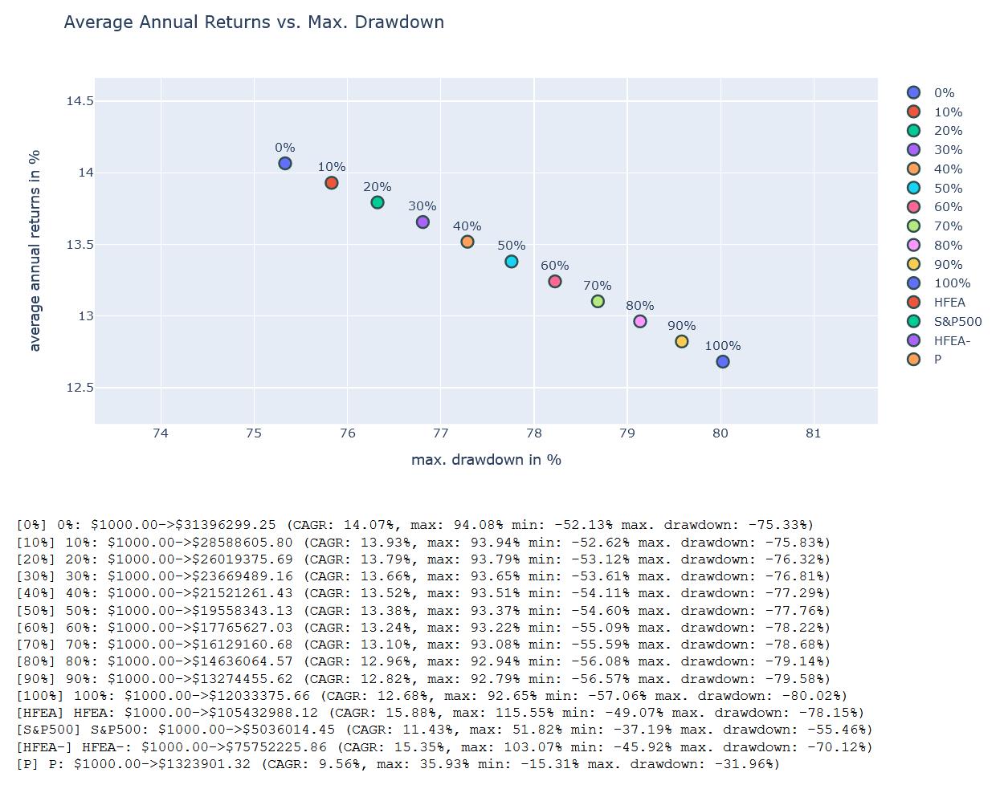

Wir sehen den gleichen Effekt hier, sogar noch etwas ausgeprägter. Der Grund dafür ist, dass wir nun alle Aktienkrisen stark mitnehmen, ohne einen ausgleichenden Effekt durch die (größtenteils) unkorrelierten Anleihen zu haben. Zudem wächst Cash nicht. Selbst Gold hat ein besseren Werterhalt als Cash.

Natürlich sieht die Situation beim **65% (3x)** Portfolio gleich aus:

&#x200B;

Interessanter wird es dagegen beim **HFEA** Portfolio:

&#x200B;

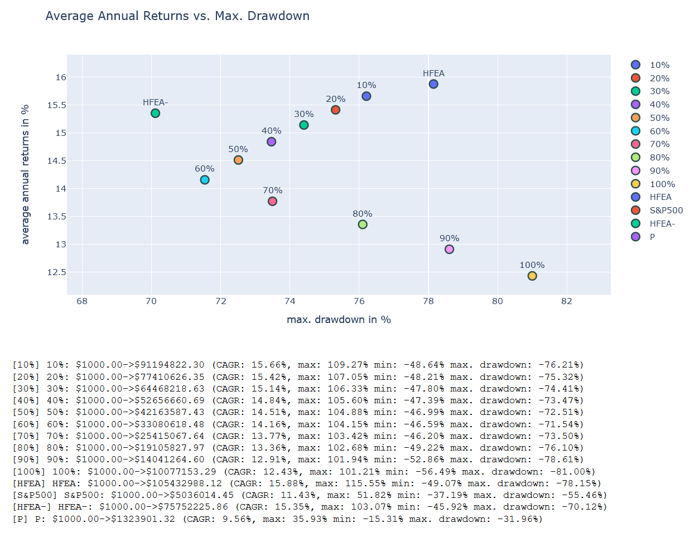

Ähnlich wie beim Gold reduziert ein Cash-Anteil leicht das Risiko. Allerdings klappt das nicht so gut wie beim Gold. Selbst 20% Cash beim **HFEA** Portfolio hat nur noch die Performance von **HFEA-**, aber ist dennoch weiter risikoreicher. Daher ergibt Cash auch beim **HFEA** Portfolio keinen Sinn.

Beim **HFEA-** Portfolio ist die Situation dann sogar noch eindeutiger:

&#x200B;

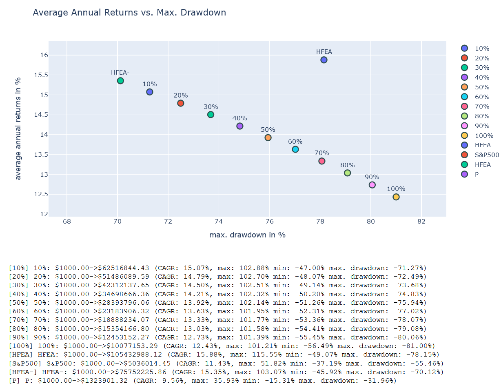

Also auch hier ergibt es keinen Sinn einen Cash-Anteil im Hedge zu besitzen. Wir können damit zusammenfassen: **Cash ist fik!**

## Fazit

Unsere Untersuchung in diesem Teil zeigt deutlich, dass – unter der Annahme, dass sich eine Situation wie in den 70er und 80er Jahren noch einmal wiederholen könnte – ein kleiner Anteil von Gold im Portfolio Sinn ergeben würde. Cash hingegen ist nicht ratsam.

Für alle weitern Teile dieser DD-Serie definiere wir jetzt 10 verschiedene Vergleichsportfolios:

* US-ETFs:
   * **HFEA**: 55% UPRO / 45% TMF
   * **HFEA+G**: 55% UPRO / 33.75% TMF / 11.25% Gold

&#x200B;

* EU-ETFs/ETNs:
   * Hohes Risiko:
      * **80%**: 80% 2x S&P 500 / 20% 1x LTT (Europa)
      * **80%+G**: 80% 2x S&P 500 / 15% 1x LTT / 5% Gold (Europa)
      * **65% (3x)**: 65% 3x S&P 500 / 35% 3x ITT (Europa)
      * **65%+G (3x)**: 65% 3x S&P 500 / 26.25% 3x ITT / 8.75% Gold (Europa)
   * Mittleres Risiko:
      * **65%**: 65% 2x S&P 500 / 35% 1x LTT (Europa)
      * **65%+G**: 65% 2x S&P 500 / 26.25% 1x LTT / 8.75% Gold (Europa)
   * Geringes Risiko:
      * **50%**: 50% 2x S&P 500 / 50% 3x LTT (Europa)
      * **50%+G**: 50% 2x S&P 500 / 37.5% 3x LTT / 12.5% Gold (Europa)

Die folgende Grafik stellt alle Portfolios zusammengefasst dar:

&#x200B;

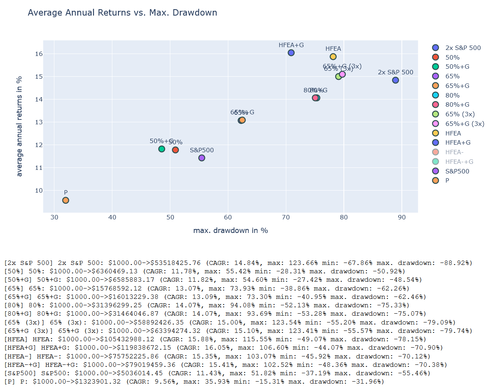

Wir sehen, dass die Gold-Portfolios besonders bei den Europäischen Varianten nur eine geringfügig andere Performance liefern. Allerdings besitzen sie auch eine höhere Diversifikation, was bei unvorhergesehenen Krisen ggf. das Risiko reduziert. Positiv sticht hingegen das **HFEA+G** hervor, welches sowohl eine bessere Performance, als auch ein deutlich geringeres Risiko aufweist.

Der Unterschied im Risiko beim **HFEA** Portfolio zeigt sich vor allem beim maximalen Einbruch. War dieser beim Original **HFEA** Portfolio 78% von 1972 bis 1982 (10 Jahre!), beträgt er beim HFEA+G Portfolio nur noch 70% in den Jahren 1972 bis 1974:

Im nächsten Teil vertreten wir einfach mal die umgekehrte These und überlegen uns, was wir an den Portfolios verbessern könnten, wenn wir annahmen, dass der Boom der Tech-Aktien weiter anhalten würde. Also so, als ob die Inflation auch in Zukunft kein Thema sein wird. Wie immer findet ihr den Code und alle Daten im Repository \[1\] und falls ihr Wünsche bezüglich besonderer Analysen und Backtests habt, schreibt mir diese in die Kommentare.

## Fragen

&#x200B;

Cash ist fik. Keiner meiner Brudis mag die Cash-Bande.

## Zugabe

Der User u/kurtextrem hatte beim letzten Mal gefragt, wie sich ein Portfolio verhalten würde, bei dem man den Aktienanteil zwischen 2x und 3x gehebelten ETFs/ETNs aufteilt. Ich habe das mal testweise mit dem **65%** Portfolio gemacht. Leider erlaubt mir Reddit keine weiteren Bilder mehr, daher verlinkte ich das einfach nur hier: [https://paste.pics/038b5d049900d7cc223f3bb54032bab7](https://paste.pics/038b5d049900d7cc223f3bb54032bab7)

Wie man sieht erhöht sich mit zunehmendem Anteil vom 3x gehebelten ETN das Risiko und die Performance. Man kann dies dann einfach gut als Zwischenschritt zwischen dem **65%** und **65% (3x)** Portfolio sehen. Zusätzlich kommt natürlich bei den 3x gehebelten ETNs vom Weisheitsbaum auch noch das Emittentenrisiko, welches man nicht simulieren kann. Es muss hier jeder selbst entscheiden wie viel mehr Risiko man bereit ist für etwas mehr Rendite zu tragen. Eventuell ist es dann doch besser (vor allem bei größeren Beträgen) direkt die US ETFs zu kaufen.

## Quellen

\[1\] [https://code.launchpad.net/zgea](https://code.launchpad.net/zgea)
