# Wie wirkt sich Nasdaq-100 statt S&P 500 aus?
**ZL;NG**

* *Mit 25% (gehebelten) Nasdaq-100 im Wachstumsanteil, kann man die Performance noch etwas erhöhen. Allerdings auch das Risiko.*
* *In seltenen Fällen macht es sogar Sinn ein paar Prozent Gold hinzu zu nehmen, um das Risiko wieder zu verringern.*

Liebe Schwestern und Brüder der Mauerstraße,

nachdem wir uns also angeschaut haben, ob Gold unser Portfolio etwas krisenfester machen kann, wollen wir heute die Gegenthese betrachten: Stellen wir uns einmal vor, dass die aktuelle Inflation nur temporär wäre und in 2 Jahren redet keiner mehr davon. Stellen wir uns dann ferner vor, dass die Zinsen wieder sinken und unrentable, überbewertete Tech-Buden weiterhin an der Börse ein Allzeithoch nach dem anderen erklimmen 🤡. Wäre es dann nicht eine gute Idee in den Nasdaq-100 statt in den S&P 500 zu investieren? Diese Frage wolle wir heute klären.

## Wie wirkt sich Nasdaq-100 statt S&P 500 aus?

## Vergleichsportfolios

An dieser Stelle möchte ich noch einmal kurz die Portfolios vom letzten Teil zusammenfassen. Wir haben 10 Portfolios zum Vergleich ausgewählt. Zwei davon in der Gruppe der US-Portfolios, welche US-ETFs verwenden. Die restlichen 8 in der Gruppe der EU-Portfolios, wo sie weiter in Gruppen für hohes, mittleres und geringes Risiko unterteilt sind. 5 Portfolios stellen die Basiskonfiguration dar  und die restlichen 5 sind Erweiterungen die Gold benutzen und mit einem „**+G**“ am Ende gekennzeichnet sind.

&#x200B;

* US-ETFs:
   * **HFEA**: 55% UPRO / 45% TMF
   * **HFEA+G**: 55% UPRO / 33.75% TMF / 11.25% Gold

&#x200B;

* EU-ETFs/ETNs:
   * Hohes Risiko:
      * **80%**: 80% 2x S&P 500 / 20% 1x LTT (Europa)
      * **80%+G**: 80% 2x S&P 500 / 15% 1x LTT / 5% Gold (Europa)
      * **65% (3x)**: 65% 3x S&P 500 / 35% 3x ITT (Europa)
      * **65%+G (3x)**: 65% 3x S&P 500 / 26.25% 3x ITT / 8.75% Gold (Europa)
   * Mittleres Risiko:
      * **65%**: 65% 2x S&P 500 / 35% 1x LTT (Europa)
      * **65%+G**: 65% 2x S&P 500 / 26.25% 1x LTT / 8.75% Gold (Europa)
   * Geringes Risiko:
      * **50%**: 50% 2x S&P 500 / 50% 3x LTT (Europa)
      * **50%+G**: 50% 2x S&P 500 / 37.5% 3x LTT / 12.5% Gold (Europa)

Die Zusammensetzung der europäischen Portfolios leitet sich direkt aus dem Namen ab. „**50%**“ bedeutet zum Beispiel, dass es ein Portfolio mit 50% Wachstumsanteil, also in diesem Falle 2x S&P 500, ist. „**65% (3x)**“ ist ein Portfolio mit 65% 3x gehebelten Wachstumsanteil, also 3x S&P 500.

Im Folgenden nehmen wir jedes dieser Portfolios und testen verschiedene Aufteilungen des Wachstumsanteils zwischen S&P 500 und Nasdaq-100 durch. Den Nasdaq-Anteil erhöhen wir in 5% Schritten, damit wir sehen können, ob sich eine Mischung aus beiden eher lohnt.

Die Backtests werden von 1943 an durchgeführt. Das ist etwas problematisch, da der Nasdaq-100 erst 1985 eingeführt wurde. Würden wir die Tests aber erst ab 1985 machen, wären wichtige Krisen wie die Energiekrise nicht mit dabei. Daher wird vor 1985 für den Nasdaq-100 Anteil halt vollständig auf S&P 500 zurückgegriffen. Wir werden in einem der folgenden Teile dann auch mal gezielt einzelne Zeitabschnitte testen, da können wir dann sehen, wie sich die Nasdaq-100 Portfolios ändern, wenn wir sie erst ab 1985 simulieren.

## Wie viel Tech darf es denn sein?

Schauen wir uns als erstes Mal das **50% Portfolios** an, wo wir ein 2x gehebelten Nasdaq-100 ETF hineinmischen:

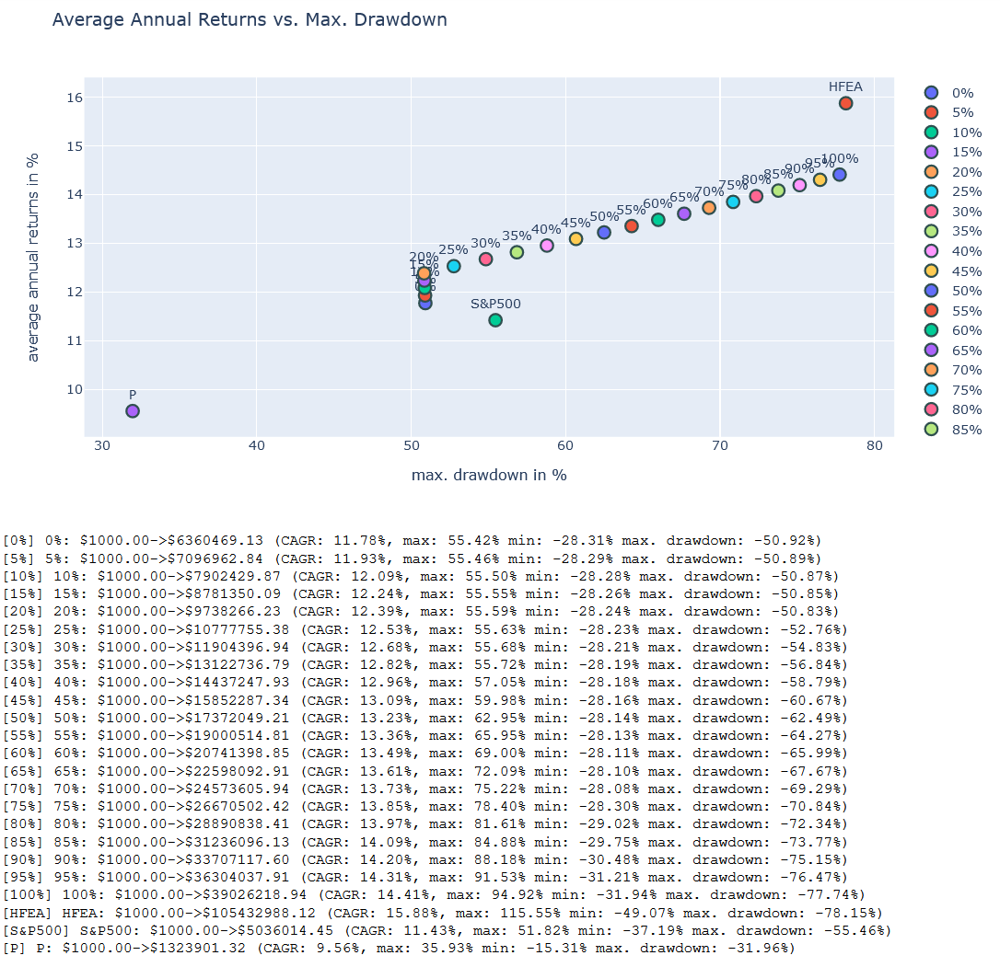

Wir sehen, dass wir gut 20% Nasdaq-100 hineinmischen können, ohne dass sich das Risiko erhöht. Dafür erhöht sich aber das CAGR. Ab 20% steigt das CAGR auch weiter an, jedoch geht dann das Risiko ebenfalls hoch. Daher definieren wir ein **50%+N** Portfolio mit 15% 2x Nasdaq-100 im Wachstumsanteil. Ich vermeide es hier exakt 20% auszuwählen um weniger Anfällig für eine Überanpassung zu sein.

Schauen wir uns nun das **65% Portfolio** mit 2x Nasdaq-100 an:

&#x200B;

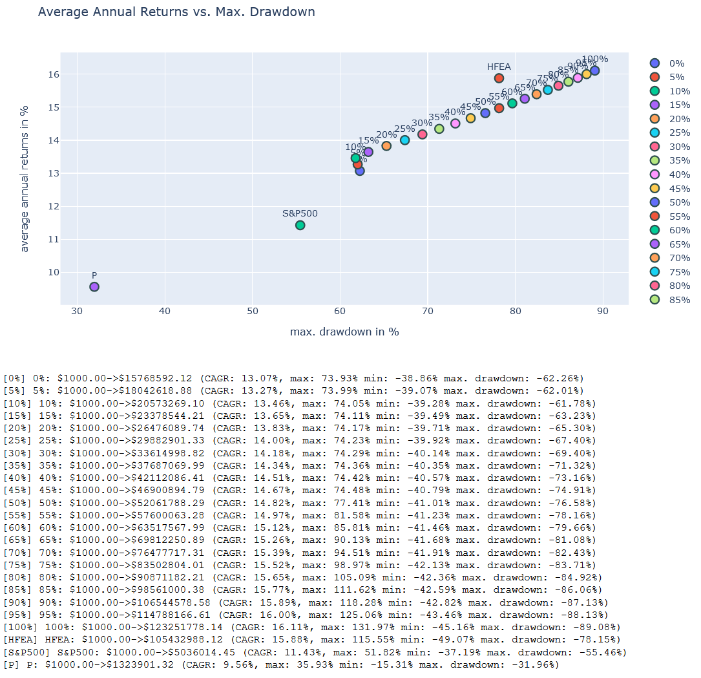

Beim 65% Portfolio sieht es ähnlich aus. Hier dürfen es aber nur noch 10% sein, ohne das Risiko signifikant zu erhöhen. Interessant ist auch, dass wir mit einer 55% Aufteilung für den 2x Nasdaq-100 das gleiche Risiko vom Original HFEA Portfolio erreichen und dann nur noch knapp 1% schlechter sind. Auch hier definieren wir ein **65%+N** Portfolio mit 15% 2x Nasdaq-100 im Wachstumsanteil.

Schauen wir uns mal das **80% Portfolio** mit 2x Nasdaq-100 an:

&#x200B;

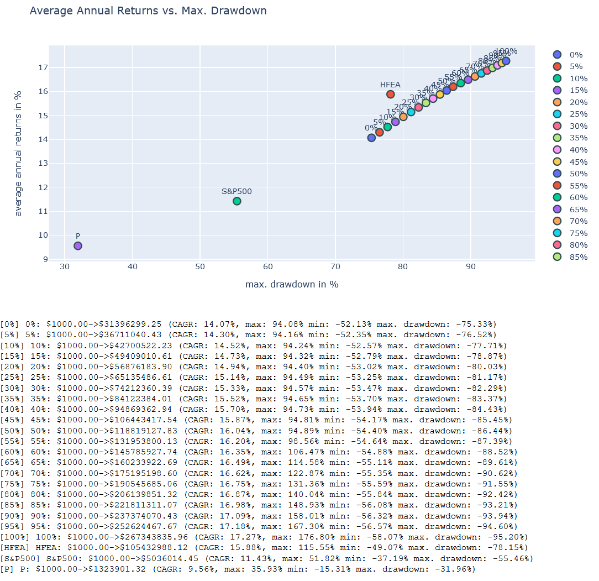

Hier sieht es schon anders aus. Dieses Mal bekommen wir keine Performance geschenkt, sondern müssen sie durch höheres Risiko bezahlen. Mit 15% 2x Nasdaq-100 im Wachstumsanteil wäre man auch hier noch in etwa einem so hohen Risiko ausgesetzt wie bei beim HFEA Portfolio und hätte dafür ein paar zehntel Prozent mehr Performance. Wir definieren dies als **80%+N** Portfolio.

Als nächstes testen wir es für das **65% (3x) Portfolio** und einem 3x Nasdaq-100 ETN:

&#x200B;

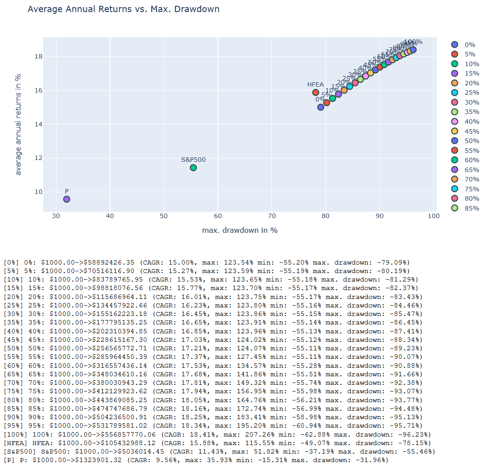

Ähnlich sieht es dann auch beim 65% (3x) Portfolio aus. Mit 15% 3x Nasdaq-100 erreichen wir dann auch endlich die Performance vom Original HFEA. Allerdings zu einem deutlich höheren Risiko. Mit schlechtem Gewissen definieren wir daher das Portfolio **65%+N (3x)** mit 15% Nasdaq-100 Anteil, wohl wissend, dass wir das HFEA Risiko überschreiten.

Natürlich wollen wir das auch direkt mit **HFEA** und einem 3x Nasdaq-100 US ETF testen:

&#x200B;

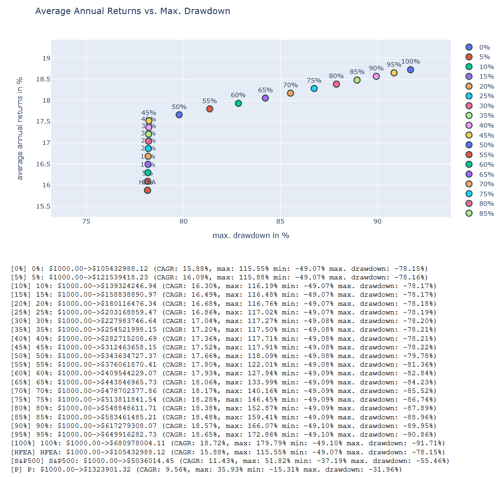

Erstaunlicherweise sehen wir beim HFEA wieder den schönen Effekt, dass wir bis zu 45% in einen 3x Nasdaq-100 US ETF (TQQQ) geben können, ohne dass das Risiko steigt. Dafür steigt das CAGR um fast 2% an. Ich bin kein Freund davon den höchsten Wert hier auszuwählen, weil das zu einer Überanpassung auf die Daten führen kann. Stattdessen würde ich hier das **HFEA+N** Portfolio mit nur 25% 3x Nasdaq-100 definieren, was immerhin 1% höheres CAGR ist. Für die risikofreudigen unter euch, wäre aber bis zu 45% drin.

## Kann man das auch vergolden?

Als nächstes wollen wir prüfen, ob wir Tech einfach in die Gold-Portfolios („**+G**“) einführen können, um bei einem gleichen Risiko höhere Renditen zu bekommen. Fangen wir hier wieder mit dem **50%+N** Portfolio an und fügen etwas Gold hinzu:

&#x200B;

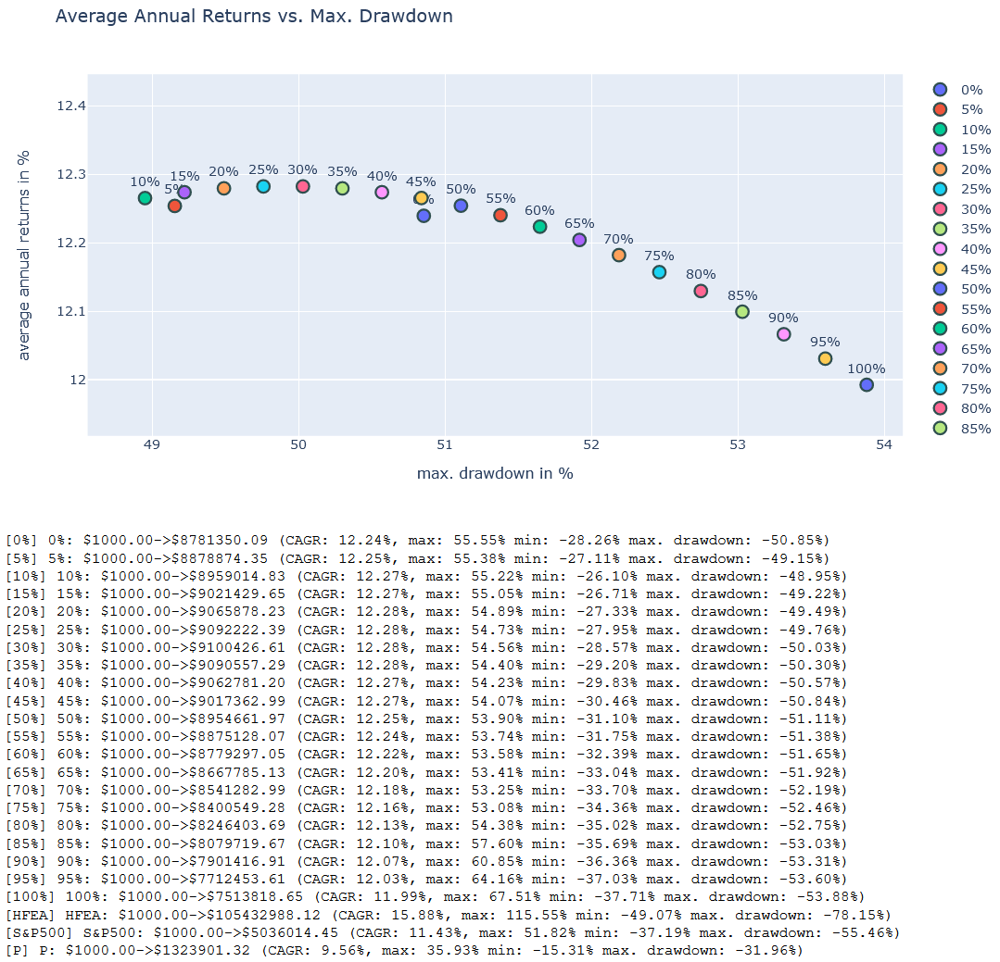

Tatsächlich kann man auch hier gut etwas Gold hinzu geben um sowohl das Risiko zu senken, als auch ganz leicht die Performance zu steigern. Ein guter Wert scheint auch hier 25% zu sein. Wir können das als **50%+NG** Portfolio definieren.

Setzen wir unseren Test mit dem **65%+N** Portfolio fort:

&#x200B;

Hier erhöht jeglicher Goldanteil eigentlich nur das Risiko. Zwar könnten wir auch die Performance noch ein paar hundertstel Prozent anheben, das davon sehen wir einfach mal ab.

Testen wir stattdessen das **80%+N** Portfolio mit Goldanteilen:

&#x200B;

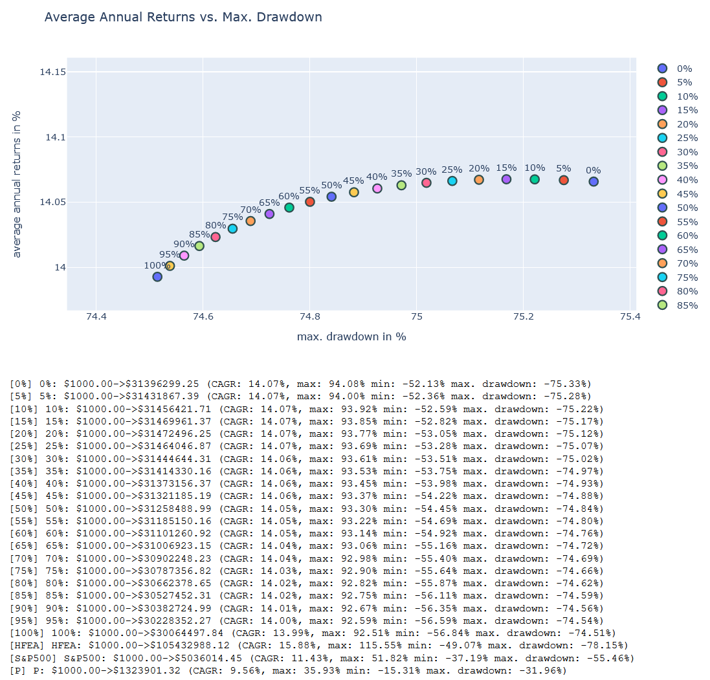

Das Einfügen von 25% Gold reduziert geringfügig das Risiko, ohne dass es Performance kostet. Wir definieren dieses Portfolio als **80%+NG**.

Gehen wir dann zum **65%+N (3x)** Portfolio über:

&#x200B;

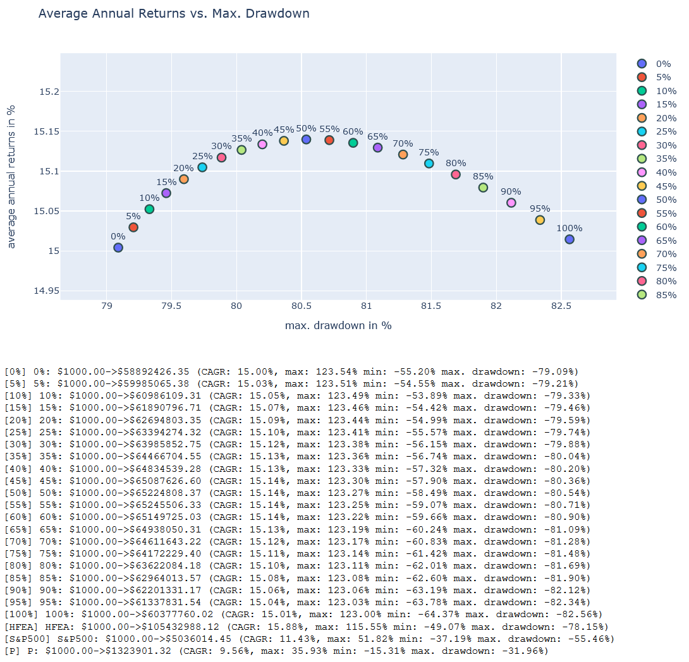

Gold erhöht das Risiko und auch etwas das CAGR. Allerdings ist das **65%+N (3x)** Portfolio schon risikoreich genug, so dass ich hier von einer weiteren Erhöhung absehe.

Als letztes prüfen wir dann das **HFEA+N** Portfolio:

&#x200B;

Hier kann die Zugabe kleiner Mengen Gold sowohl das Risiko verringern als auch das CAGR leicht erhöhen. Wie ich schon oben geschrieben habe, bin ich kein Fan von Extremwerten. Daher würde ich mich hier für 15% Gold entscheiden und das Portfolio als **HFEA+NG** bezeichnen.

## Fazit

Wie wir sehen konnten, kann das Hinzufügen von Nasdaq-100 Anteilen in den Wachstumsanteil die Performance in den meisten Fällen leicht steigern. In einigen wenigen Fällen kann sogar noch Gold hinzugenommen werden, um dann das Risiko wieder etwas zu minimieren. Die folgenden Portfolios haben wir nun insgesamt definiert:

&#x200B;

* US-ETFs:
   * **HFEA**: 55% UPRO / 45% TMF
   * **HFEA+G**: 55% UPRO / 33.75% TMF / 11.25% Gold
   * **HFEA+N**: 41.25% UPRO / 13,75% TQQQ / 45% TMF
   * **HFEA+NG**: 41.25% UPRO / 13,75% TQQQ / 38.25% TMF / 6.75% Gold

&#x200B;

* EU-ETFs/ETNs:
   * Hohes Risiko:
      * **80%**: 80% 2x S&P 500 / 20% 1x LTT (Europa)
      * **80%+G**: 80% 2x S&P 500 / 15% 1x LTT / 5% Gold (Europa)
      * **80%+N**: 68% 2x S&P 500 / 12% 2x Nasdaq-100 / 20% 1x LTT (Europa)
      * **80%+NG**: 68% 2x S&P 500 / 12% 2x Nasdaq-100 / 15% 1x LTT / 5% Gold (Europa)
      * **65% (3x)**: 65% 3x S&P 500 / 35% 3x ITT (Europa)
      * **65%+G (3x)**: 65% 3x S&P 500 / 26.25% 3x ITT / 8.75% Gold (Europa)
      * **65%+N (3x)**: 55.25% 3x S&P 500 / 9.75% 3x Nasdaq-100 / 35% 3x ITT (Europa)
   * Mittleres Risiko:
      * **65%**: 65% 2x S&P 500 / 35% 1x LTT (Europa)
      * **65%+G**: 65% 2x S&P 500 / 26.25% 1x LTT / 8.75% Gold (Europa)
      * **65%+N**: 55.25% 2x S&P 500 / 9.75% 2x Nasdaq-100 / 35% 1x LTT (Europa)
   * Geringes Risiko:
      * **50%**: 50% 2x S&P 500 / 50% 3x LTT (Europa)
      * **50%+G**: 50% 2x S&P 500 / 37.5% 3x LTT / 12.5% Gold (Europa)
      * **50%+N**: 42.5% 2x S&P 500 / 7.5% 2x Nasdaq-100 / 50% 3x LTT (Europa)
      * **50%+NG**: 42.5% 2x S&P 500 / 7.5% 2x Nasdaq-100 / 37.5% 3x LTT / 12.5% Gold (Europa)

Zusammengefasst ergeben sich für alle Portfolios die folgende Gewinn-/Risiko-Einordnungen:

&#x200B;

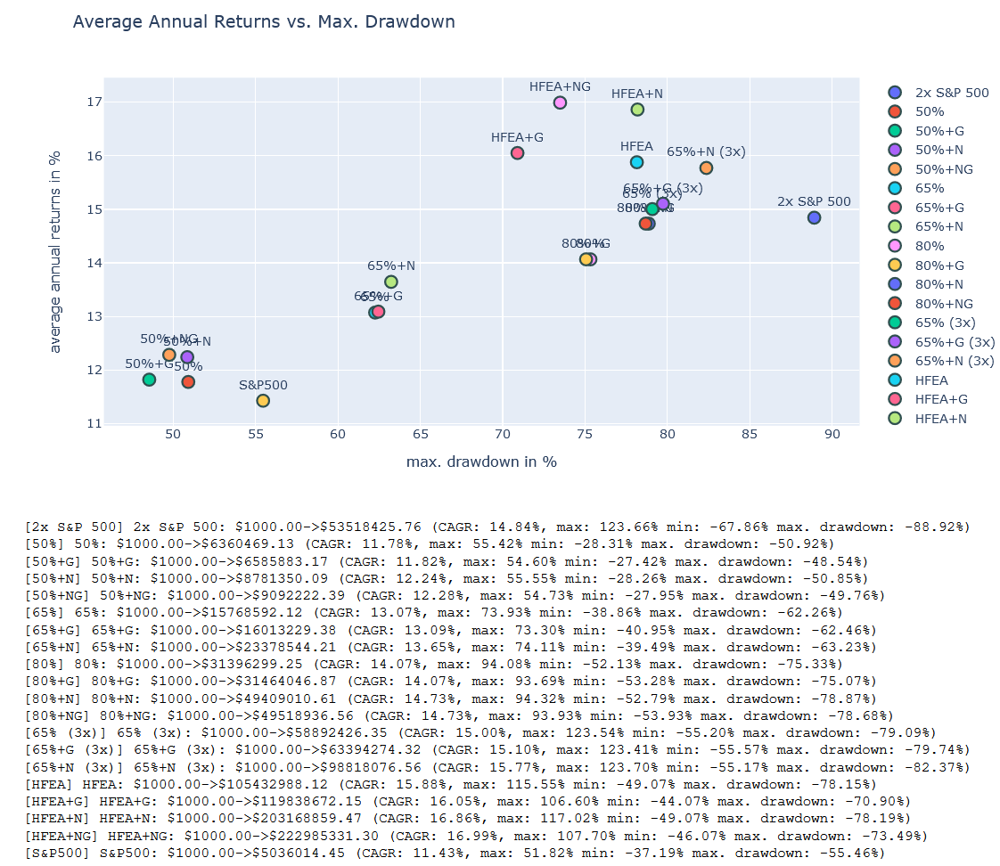

Das sieht inzwischen ziemlich chaotisch aus, daher stelle ich die Cluster mal etwas vergrößert dar:

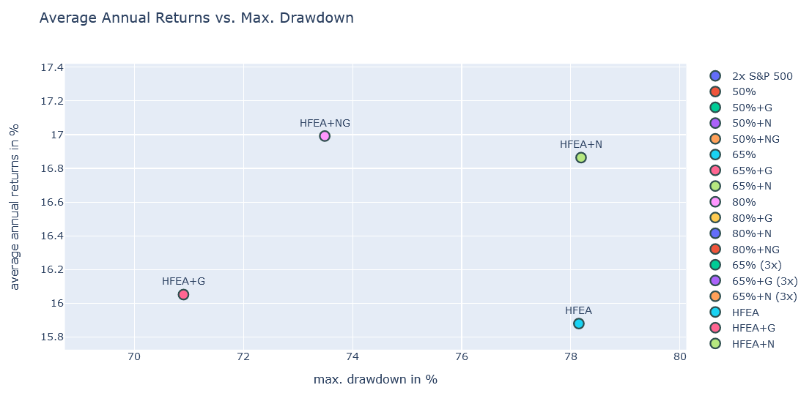

&#x200B;

&#x200B;

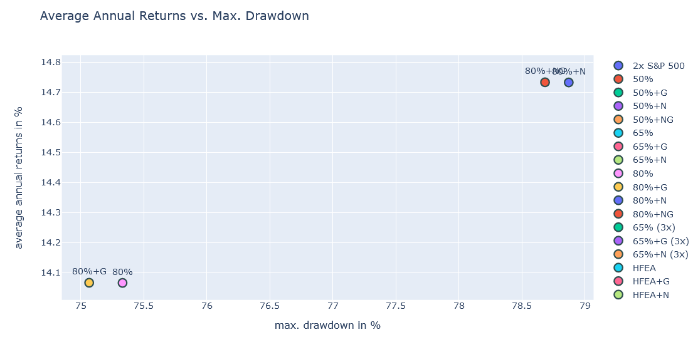

&#x200B;

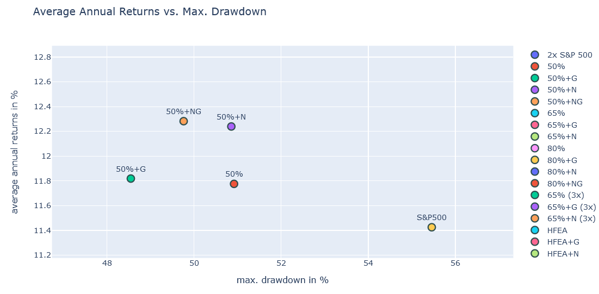

Man sieht gut, dass nahezu in allen Fällen die „**+G**“ Portfoliovariante ein geringeres Risiko besitzt. Dafür hat die „**+N**“ Variante eine höhere Performance. In den Fällen in denen eine „**+NG**“ Variante vorhanden ist, ist diese gegenüber der reinen „**+N**“ Variante zu bevorzugen. Vorausgesetzt, man möchte Gold in seinem Portfolio haben.

Damit wollen wir mit der Definition von HFEA ähnlichen Portfolios aufhören, bevor wir es noch komplizierter machen. Im nächsten Teil untersuchen wir eine Alternative, bei der wir einfach unseren Wachstumsanteil im Portfolio verkaufen, falls es zu einer Phase hoher Volatilität im Markt kommt. Da dieses Thema ziemlich komplex ist, kann ich noch nicht versprechen, dass ich es bis zum nächsten Sonntag fertig bekomme.

Wie immer findet ihr die Daten und den Source-Code im Repository \[1\].

## Fragen

Diesmal gab es keine passenden Fragen.

## Quellen

\[1\] [https://code.launchpad.net/zgea](https://code.launchpad.net/zgea)
