# Hebel für den Langlauf

**ZL;NG**

* *Verkauft man einen gehebelten S&P 500 oder Nasdaq-100 wenn die Volatilität zunimmt und kauft man ihn zurück, wenn diese abnimmt, sind ziemlich gute Ergebnisse möglich.*
* *Hierzu wird ein Moving Average Wert als Verkaufstrigger verwendet.*
* *Allerdings hat der Spread dabei einen recht starken negativen Einfluss, was auch einen Hinweis darauf gibt, dass die Strategie durch den Steuerabzug problematisch werden könnte.*

Liebe Schwestern und Brüder der Mauerstraße,

in den letzten Teilen haben wir in das klassische HFEA Portfolio ein wenig Gold und Technologie hineingestreut um eine für den jeweiligen Geschmack bessere Mischung aus Gewinn und Risiko zu erhalten. Nun besitzen wir eine ganze Reihe von komplizierten Portfolios als Kandidaten. Da stellt sich schon die Frage: Gibt es denn nicht eine Möglichkeit ganz auf den Hedge zu verzichten?

Eigentlich sollte das doch ziemlich einfach sein? Wir müssen nur im richtigen Moment unseren Wachstumsanteil verkaufen und im richtigen Moment wieder einkaufen, oder? Tja, hört sich total easy an und heute schauen wir uns eine Strategie an, welche dies angeblich ermöglicht. Es bleibt also spannend.

## Hebel für den Langlauf

## Einführung in die Strategie

Im Jahr 2016 ist ein Artikel mit dem Namen „Leverage for the long Run“ \[1\] erschienen, in welchem der Autor eine Strategie vorschlägt, bei der ein gehebelter ETF immer dann verkauft wird, wenn die Volatilität im Markt zu stark wird. Sinkt die Volatilität ab, wird wieder zurückgekauft.

Wie wir alle wissen haben gehebelte ETFs ja die sogenannte Pfadabhängigkeit, welche im Englischen auch „Volatility Decay“ genannt wird. Ist der Markt volatil, dann bedeutet das in der Regel nichts anderes, als dass ein Basiswert an einem Tag um X Prozent sinkt, nur um am folgenden Tag wieder um Y Prozent zu steigen. Selbst wenn X und Y gleich groß sind, haben wir im Anschluss weniger Geld als zuvor. Je größer der tägliche Hebel eines Instruments ist, desto stärker ist dieser Effekt ausgeprägt.

Der Autor zeigt in empirischen Untersuchungen mit historischen Daten, dass in Zeiten hoher Volatilität im Markt die Korrelation eines Tagesgewinns zum Gewinn des Vortags besonders gering ist. Das bedeutet, dass in solchen Zeiten die Börsenwerte dazu neigen jeden Tag die Richtung zu wechseln. Er begründet dies, dass in unruhigen Börsenzeiten häufig überreagiert wird, was dann dieses ständige Hin und Her an der Börse verursacht. Und genau jenes Verhalten ist es wo die Pfadabhängigkeit von gehebelten ETFs besonders weh tut und daher sollte man diese ETFs zu genau verkaufen. Nun stellt sich natürlich die Frage, wie man zuverlässig erkennen kann, ob ein Markt besonders volatil ist oder nicht?

Hierzu führt der Autor empirische Untersuchengen mit Daten von 1928 bis 2020 durch (es gab bis 2020 Anpassungen des Artikels), welche zeigen, dass beim Unterschreiten des 200 Tage Mittelwerts tendenziell eine höhere Volatilität am Markt vorherrscht als in Zeiten in welchen ein Basiswert über dem 200 Tage Mittelwert schließt. Er hat diese Untersuchung für verschiedene typische Mittelwerte durchgeführt (10, 20, 50, 100 und 200) und kommt zum Schluss, dass der 200 Tage Mittelwert als Signal am geeignetsten ist.

###### Wir verkaufen unseren 3x gehebelten S&P 500 immer dann wenn der ungehebelte S&P 500 \(in rot\) die MA200 Linie \(in blau\) unterschritten hat. Wir kaufen zurück, wenn er über der MA200 Linie schließt.

Er erklärt auch, dass in 15 vergangenen Rezessionen der US-Wirtschaft der S&P 500 an 68% der Tage unterhalb vom MA200 (Moving Average 200 Tage) gehandelt wurde. Während in Wachstumsphasen dies nur bei 19% der Tage der Fall war. Also ist seine Strategie ganz einfach: Schließt der S&P 500 unterhalb der MA200 Linie, muss er verkauft werden. Schließt er dagegen darüber, kann er wieder zurückgekauft werden. In Backtests zeigt der Autor dann, dass diese Strategie in starken Wachstumsphasen in Kombination mit einem 3x gehebelten S&P 500 ETF etwas schlechtere Ergebnisse liefert als eine einfache Buy and Hold-Strategie. Aber dafür verhindert die Strategie in vergangenen Krisen zuverlässig einen extremen Verlust.

Natürlich ist diese Strategie bei vielen von euch schon bekannt und u/what_the_actual_luck hat neulich auch schon eine interessante Kritik an der Strategie mit uns geteilt \[2\]. Im Wesentlichen bezieht sich die Kritik darauf, dass die MA200 Linie mehr oder weniger beliebig gewählt wurde und es dafür keine makroökonomische Grundlage gibt. Außerdem sei bei weiteren Experimenten gezeigt worden, dass bei einer nur leicht veränderten Anzahl von Tagen bei der Mittelwertbildung die Strategie eine deutlich schlechtere Performance liefert.

Dies sei ein Hinweis auf eine Überanpassung. In der Tat hat der Autor den Backtest mit den gleichen Daten durchgeführt, die er zuvor verwendet hatte um die MA200 Linie als „ideal“ zu identifizieren. Dies führt dann schon einmal schnell zu einer Überanpassung. Daher werden wir uns heute die Strategie noch einmal genauer ansehen und eigene Experimente dazu durchführen. Hierzu gehört auch eine erneute Identifizierung einer geeigneten Anzahl von Tagen für die Mittelwertbildung.

## Welcher Mittelwert ist für Aktien ideal?

In einer ersten Versuchsreihe wenden wir die Strategie auf den S&P 500 an. Hierbei verwenden wir unterschiedliche Hebeln und ermitteln jeweils eine Anzahl von Tagen für den Mittelwert, bei welchen ein Ausstieg und Wiedereinstieg in den ETF am günstigsten wäre. Dies tun wir allerdings nur mit den Daten von 1943 bis 1985, denn im Anschluss wiederholen wir das Experiment mit den Daten von 1986 bis 2021 und schauen, ob sich unser Ergebnis stark verändert. Dieses Vorgehen soll eine Überanpassung vermeiden.

Wir beginnen mit dem europäischen 3x gehebelten S&P 500. Wichtig ist hierbei jedoch, dass wir den Mittelwert über den ungehebelten S&P 500 berechnen und darüber dann unsere Verkaufs- oder Kaufentscheidung treffen. Wir führen eine Reihe von Experimenten mit Mittelwerten von 40 Tagen bis 500 Tagen durch, welche in 10 Tage Schritten erhöht werden. Dies ergibt die folgende Grafik:

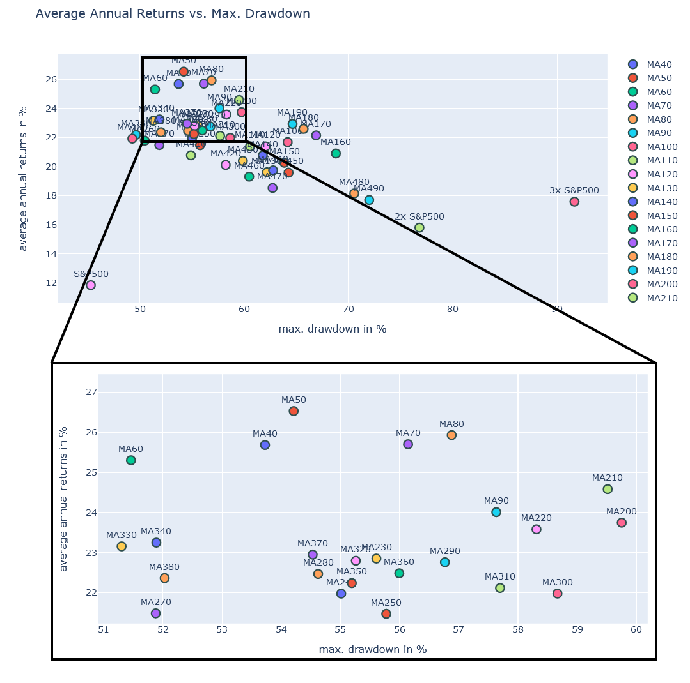

Wir sehen, dass sich ein breitgezogenes Cluster ausbildet. Hier selektieren wir einen Bereich mit vielen Werten, welcher möglichst weit links oben liegt. **Wir müssen hier unbedingt bedenken, dass die hier vorliegenden Daten 365 Tage umfassen und nicht nur die 253 Handelstage der US-Börse \[3\]. Das bedeutet, dass wir die hier ermittelte Anzahl an Tagen durch 253/365 teilen müssen um den Wert zu erhalten, den man in einem Chartingtool beim Mittelwert einstellen müsste.**

Es scheint durchaus wilde Sprünge zwischen der Werten im Cluster zu geben ganz oben sehen wir vereinzelt zweistellige Werte, dann geht es erst wieder mit 200 Tagen weiter bis ca. 370 Tage und Werte darüber hinaus liegen dann wiederum außerhalb des reingezoomten Bildausschnittes. Es ist daher schwer einen richtig guten Wert zu finden. Stattdessen mache ich jetzt das, was im Machine Learning immer gemacht wird, wenn man sich nicht entscheiden kann: Man berechnet den Mittelwert aller akzeptablen Lösungen.

Hierbei lasse ich aber die zweistelligen Werte außenvor. Denn diese kommen mir wie Ausreißer vor, da die Werte von 100 bis 200 nicht im Bildausschnitt zu sehen sind. Würden wir also den Mittelwert über diese kleinen Werte und die großen Werte berechnen, könnte es passieren, dass wir exakt in dem Bereich landen, der außerhalb vom Bildausschnitt liegt und daher für uns ungünstig ist.

Mitteln wir nun alle Werte über 200, kommen wir auf einen Wert von 295. Das ist ziemlich witzig, denn umgerechnet in Handelstagen entspricht dies 204,48 und ist damit sehr nahe an den 200 Tagen, die der Artikel vorschlägt.

Im nächsten Schritt führen wir das gleiche Experiment für die Jahre 1986 bis 2021 durch:

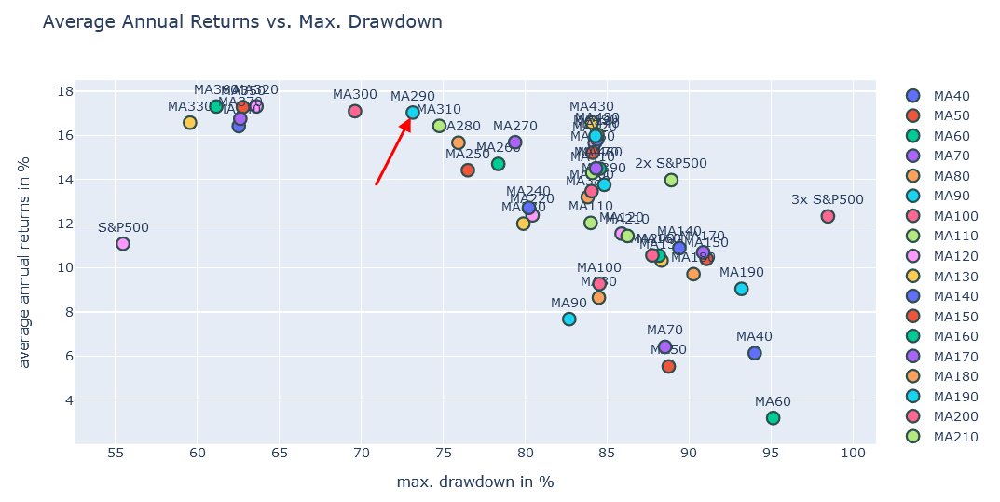

Wir sehen deutlich, dass sich das Cluster an Punkten verändert hat. Allerdings liegt unser ausgewählter Wert von 290 (bzw. 295) immer noch im eher linken oberen Bereich des Clusters. Der maximale Einbruch hat zugenommen und das CAGR abgenommen, aber das gleiche gilt auch für die Buy and Hold Vergleichsportfolios. Wir können also sagen, dass die Auswahl von 290 Tagen bzw. 200 Handelstagen für einen 3x gehebelten S&P 500 ETF vernünftig erscheint.

Ermitteln wir nur nun eine geeignete Anzahl an Tagen für einen 2x gehebelten S&P 500 ETF:

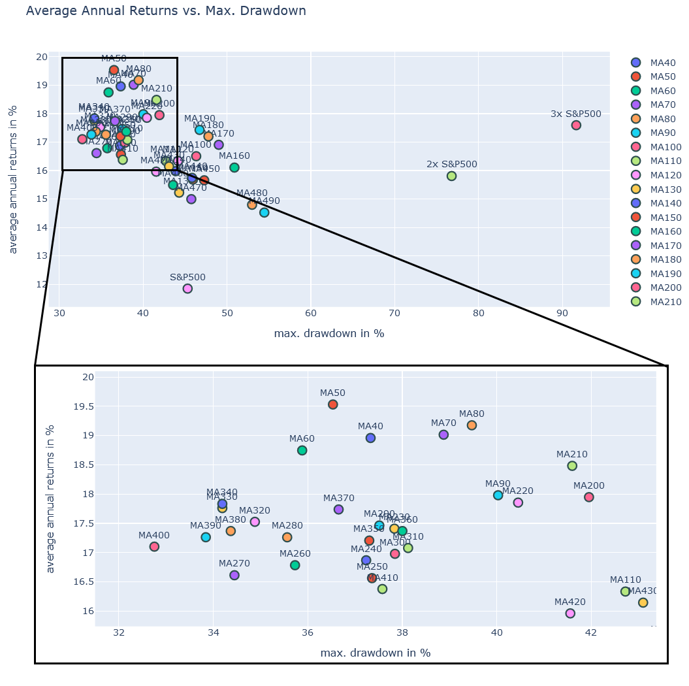

Hier machen wir wieder das gleiche Spiel: Wir wählen den Bereich des Clusters aus, den wir besonders interessant finde und mittlere die Anzahl der darin vorkommenden Tage. Auch hier nehmen wir alle Werte unter 110 heraus, weil mir die Zwischenwerte bis 200 fehlen. Das Ergebnis liegt bei 314 Tage, also umgerechnet ca. 218 Handelstagen. Das liegt auch gar nicht so weit weg von unseren 290 Tagen für den 3x gehebelten S&P 500, was bestätigt, dass wir oben schon einen vernünftigen Wert ausgewählt haben.

Schauen wir uns das mal für die Jahre 1986 bis 2021 an:

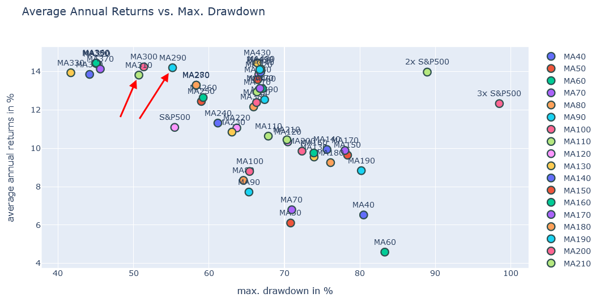

Und auch hier liegen wir mit 310 bzw. 290 Tagen gar nicht so schlecht.

Nun wiederholen wir das Spiel für den 3x gehebelten Nasdaq-100:

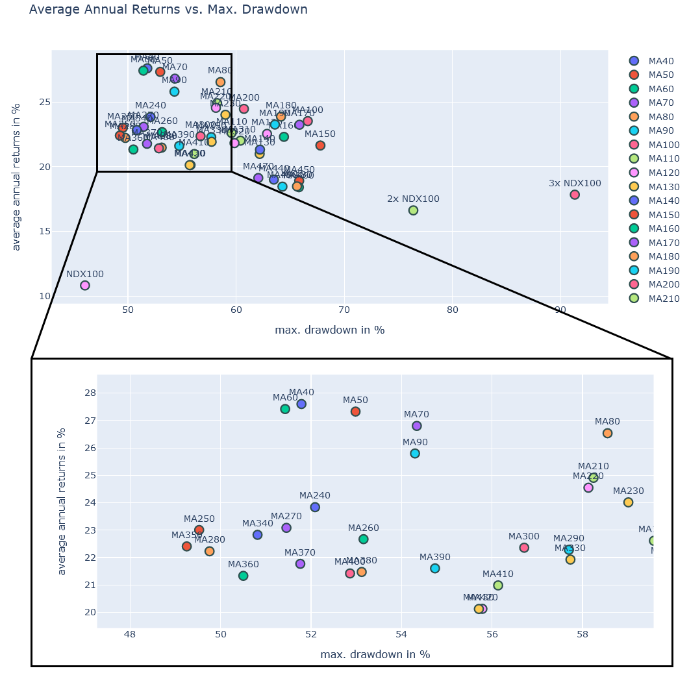

Wenn wir hier den Mittelwert berechnen (und die zweistelligen Werte weglassen), kommen wir auf 324 Tage. Schauen wir uns mal die Jahre 1986 bis 2021 an:

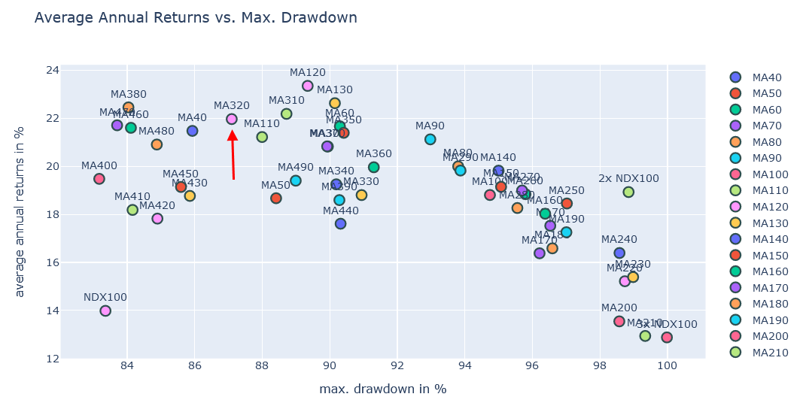

Mit unserer gewählten Anzahl an Tagen liegen wir auch hier weiterhin stabil im linken oberen Bereich des Punkteclusters.

Beim 2x Nasdaq-100 sieht es in den Jahren 1943 bis 1986 folgendermaßen aus:

Bei der Mittelung der Werte (wobei wir auch hier die Werte unter 200 weglassen) kommen wir auf 306 Tage und damit wieder sehr dicht an die 320 Tage vom Experiment zuvor. Schauen wir uns das für die Jahre 1986 bis 2021 an:

Also liegt unser gewählter Wert von 310 Tagen auch hier wieder in einem guten Bereich. Das gleiche gilt auch für die 320 Tage vom 3x gehebelten Nasdaq. Damit sollten also 310 bis 320 Tage (215 bis 222 Handelstage) gute Ergebnisse liefern.

## Welcher Mittelwert ist für Anleihen ideal?

Als nächstes wollen wir diese Experimente für ausgewählte Anleihen-Werte durchführen. Starten wir hier mit den ungehebelten LTTs:

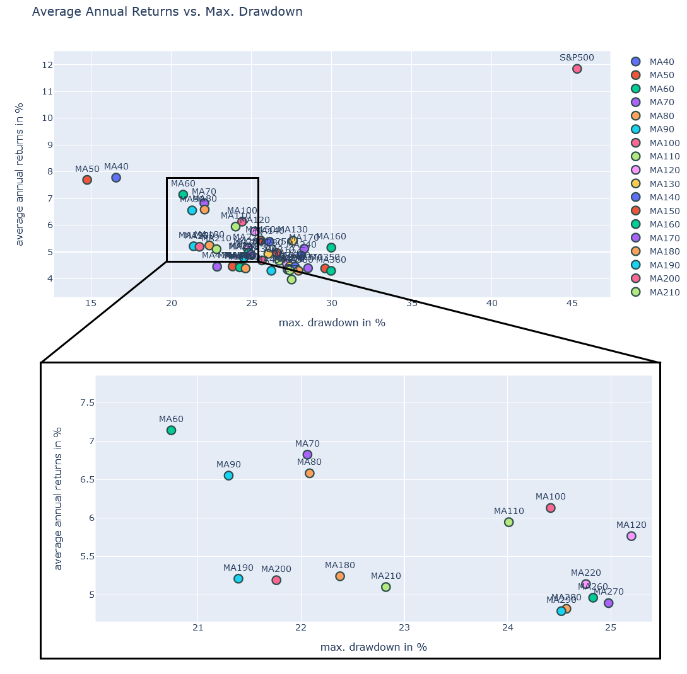

Um den Mittelwert für die hier gezeigten Tage auszurechnen, lassen wir alle Werte über 120 draußen. Denn zwischen 120 und 180, gibt es in diesem Bildausschnitt keinen räumlichen Zusammenhang. Wir behandeln diese Werte also genauso als Ausreißer, wie die kleinen Werte bei den Aktien. Somit ergibt sich ein Mittelwert von 90 Tagen (ca. 62 Handelstage). Jetzt testen wir den Wert in den Jahren 1986 bis 2021:

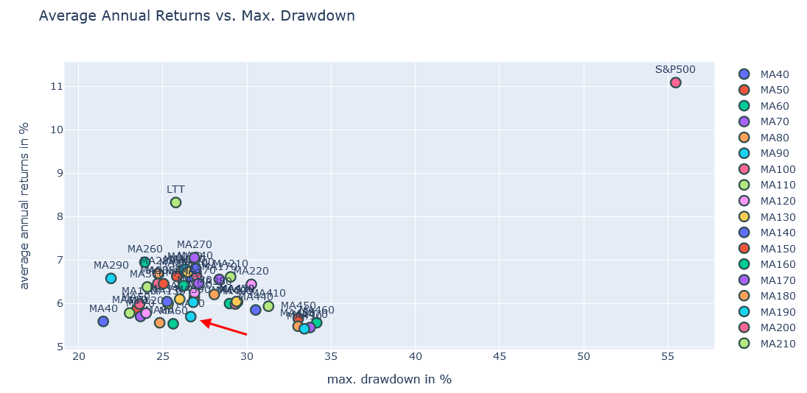

Zwar liegt der Wert nicht mehr ganz so gut wie noch in Jahren von 1943 bis 1985, aber die Region innerhalb der Punktewolke ist immer noch die gleiche.

Wiederholen wir das Experiment nun für die 3x gehebelten LTTs:

Diesmal ist es schwieriger einen sinnvollen Bereich der Punktewolke auszuwählen, da diese ziemlich langezogen und im oberen Bereich ausgedünnt ist. Der Mittelwert der hier hervorgehobenen Punkte ist 75 Tage. Aber wir sehen auch, dass unsere 90 Tage vom vorherigen Experiment auch vorn dabei sind.

Das testen wir jetzt über die Jahre 1986 bis 2021:

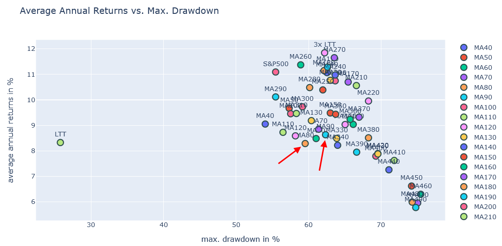

Hier liegen unsere ausgewählten Werte zwar wieder etwas ungünstiger in der Wolke, aber sie sind nicht ganz abgeschieden. Also sind auch diese Werte über den Test-Zeitbereich stabil. Was auch sehr schön ist: Sowohl 80 Tage als auch 90 Tage liegen relativ dicht beieinander, was zeigt, dass man für LTT gut Werte zwischen 75 und 90 Tagen (ca. 52 bis 62 Handelstage) auswählen kann.

Als letztes schauen wir uns die 3x gehebelten ITTs an:

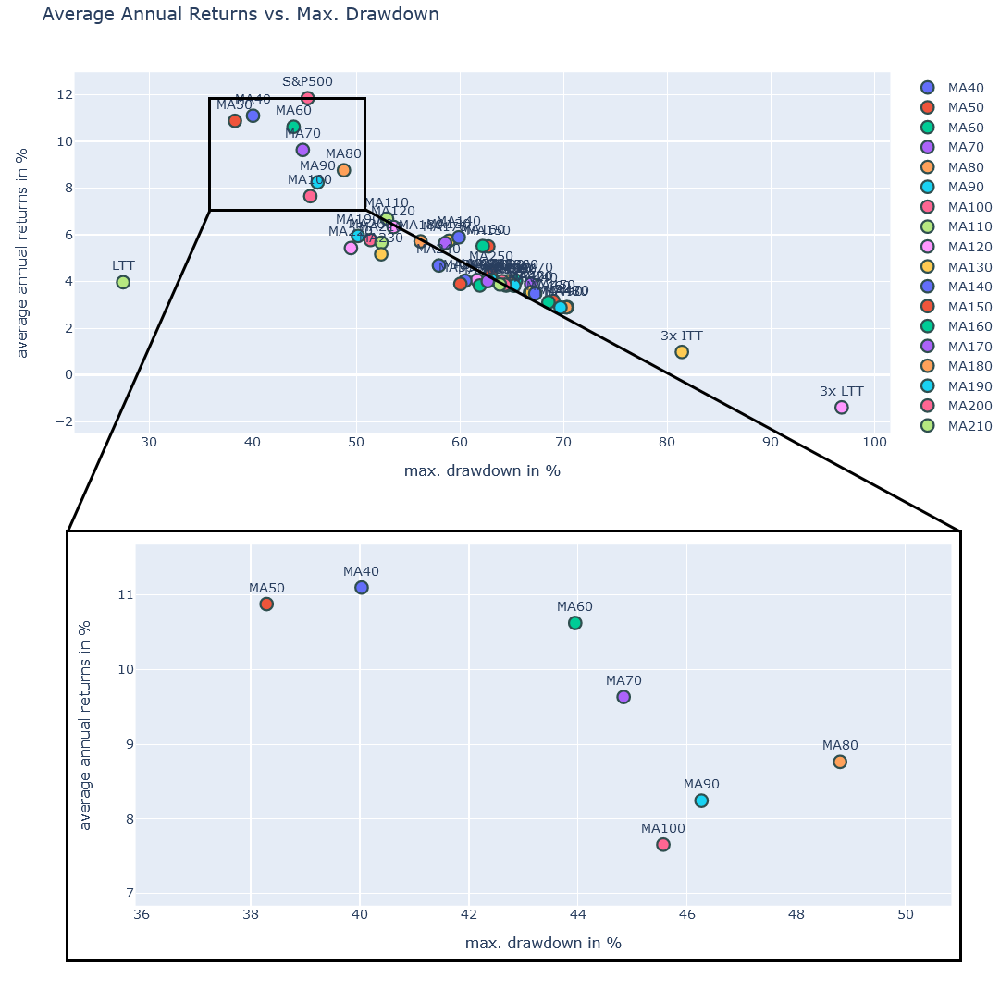

Auch hier ist das Problem, dass die Punktewolke langezogen und im interessanten Bereich ausgedünnt ist. Errechnen wir hier den Mittelwert der angezeigten Punkte kommen wir auf 70 Tage. Das ist insofern gut, da dies auch die Experimente mit den LTTs bestätigt.

Der Test über die Jahre 1986 bis 2021 sieht dann folgendermaßen aus:

Also auch hier liegt der ausgewählte Wert von 70 Tagen (ca. 49 Handelstage) immer noch relativ gut in der Wolke.

Man muss aber schon sagen, dass bei den Anleihen große Unterschiede zwischen 1943-1985 und 1986-2021 bestehen: Während im ersten Zeitabschnitt die Strategie mit dem Verkauf und Rückkauf in Abhängigkeit vom Mittelwert gute Ergebnisse liefert, performt im zweiten Zeitabschnitt ein einfaches Buy and Hold grundsätzlich besser.

## Was ist ein guter Mittelwert für Gold?

Schauen wir uns abschließend die Situation noch einmal für Gold an. Auch hier starten wir mit dem Zeitbereich 1943 bis 1985:

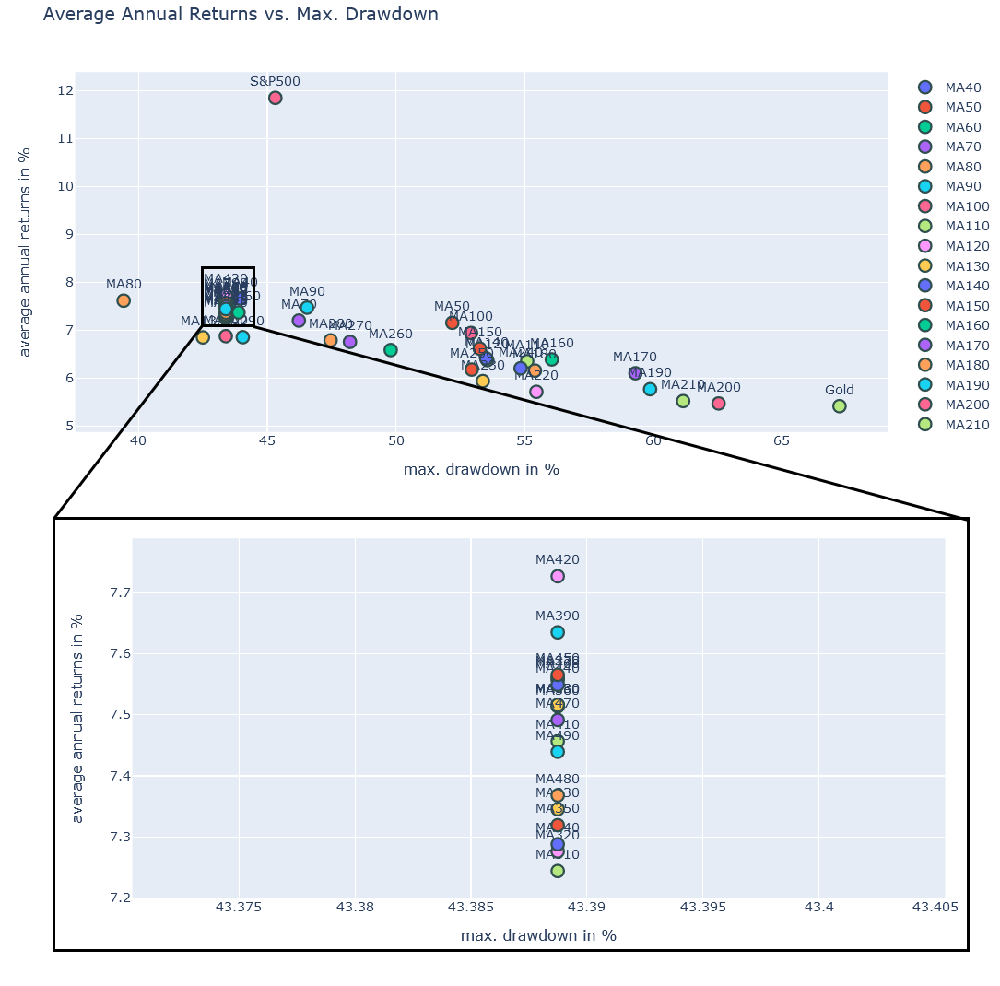

Wenn diese Punkte gemittelt werden, ergibt sich ein Wert von 402. Diesen können wir dann gleich im Zeitbereich 1986-2021 testen.

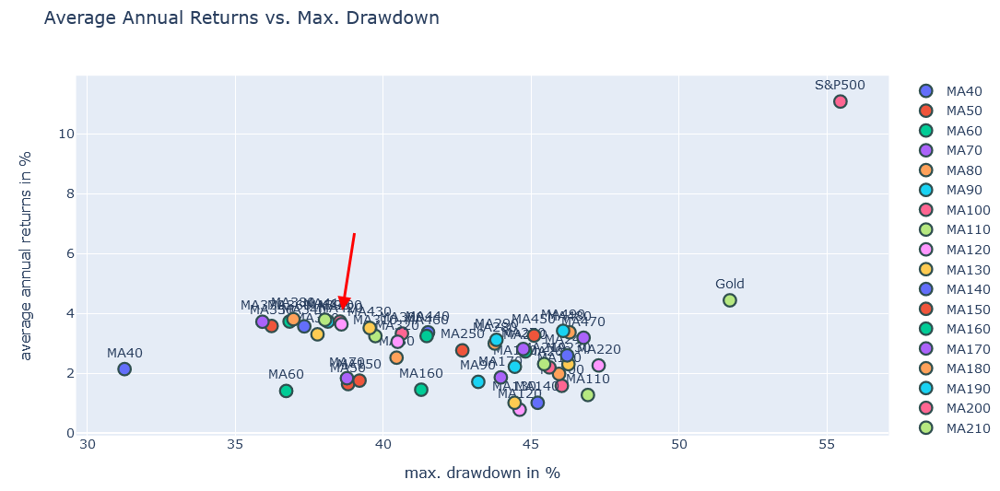

Auch in diesem Fall liegt der von uns ausgewählte Wert von 400 Tagen (ca. 277 Handelstage) recht stabil und gut in der Punktewolke.

## Fazit

Wir haben nun für alle Anlageklassen einen Wert für die Anzahl an Tage ermittelt, bei dem ein Verkauf bzw. Neukauf Sinn ergeben würde. Zusammengefasst sind das die folgenden Werte:

* S&P 500: 290 Tage (ca. **200 Handelstage**)
* Nasdaq-100: 320 Tage (ca. **220 Handelstage**)
* LTT: 90 Tage (ca. **60 Handelstage**)
* ITT: 70 Tage (ca. **50 Handelstage**)
* Gold: 400 Tage (ca. **280 Handelstage**)

Nun können wir Portfolios, welche diese Werte benutzen, im Vergleich zu ihren Basiswerten über den gesamten Zeitraum hinweg testen:

&#x200B;

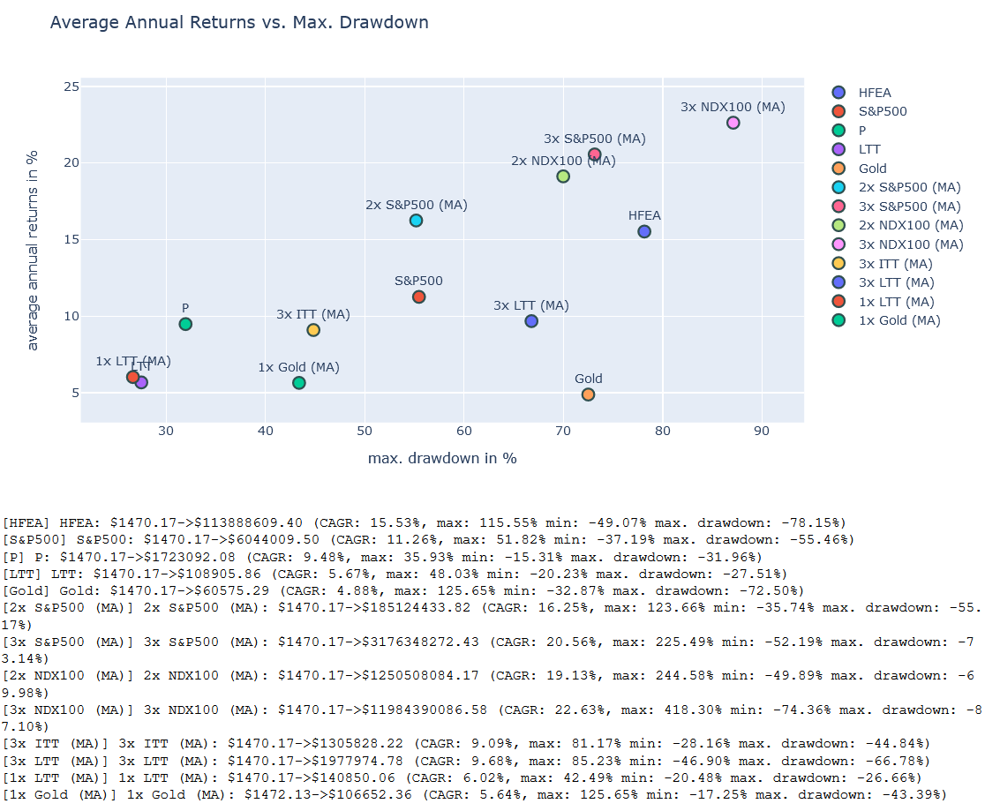

Wir sehen, dass die Strategie mit dem Mittelwert in der Regel ein Buy and Hold vom Basiswert ausperformt. Die Mittelwert-Strategie beim S&P 500 liefert sowohl in der 2x als auch 3x gehebelten Variante eine bessere Performance als HFEA und das bei einem geringeren Risiko. Lediglich die 3x gehebelten Nasdaq-100 ETFs haben ein höheres Risiko als HFEA, dafür aber auch ein CAGR von fast 23%.

Was wir hier jedoch nicht berücksichtigt hatten ist der Spread. Gerade in Krisenzeiten kann es passieren, dass wir einen ETF mehrmals hintereinander abwechselnd kaufen und wieder verkaufen. Da wirkt sich der Spread dann besonders schädlich aus. Daher sollten wir den gleichen Test noch einmal mit einem Spread von 0,2% durchführen:

&#x200B;

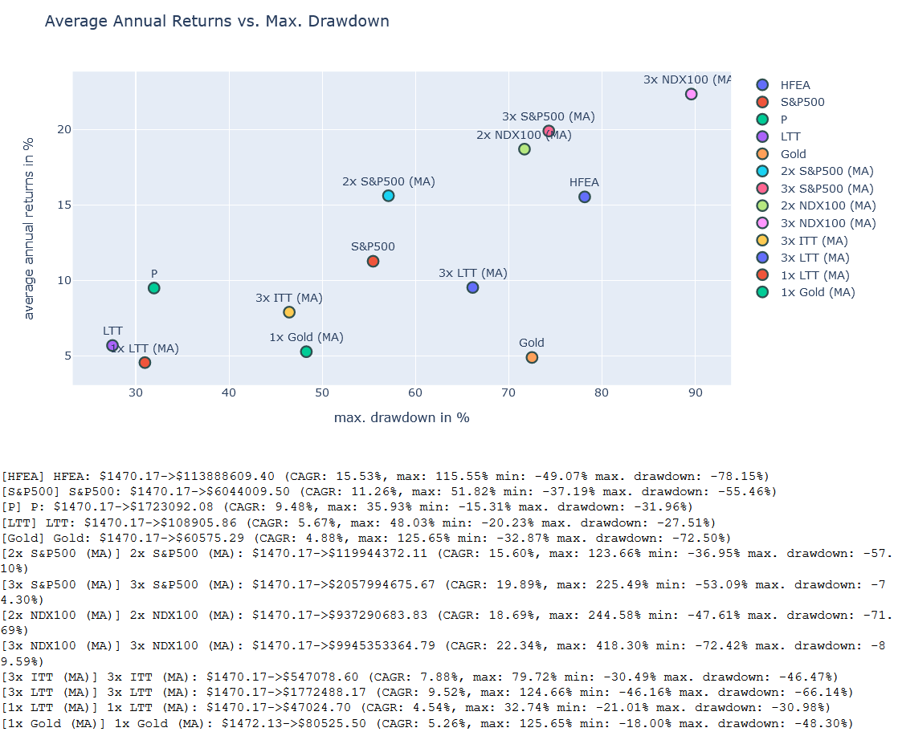

Wir sehen, dass der Spread im Großen und Ganzen das CAGR um ca. 1% reduziert. Damit erreicht die Strategie bei Aktien weiterhin sehr gute Ergebnisse im Vergleich zu HFEA. Allerdings deutet dies auf ein weiteres Problem hin: Bisher berücksichtigen wir auch keine Steuern. Schon ein kleiner Spread von 0,2% reduziert das CAGR um 1%. Was richtet denn dann eine Steuer an, die um Größenordnungen höher liegt als der Spread? Zwar schlägt die Steuer nicht bei jedem Verkauf voll zu, aber es ist schwer vorstellbar, dass diese Strategie weiterhin so erfolgreich sein wird, wenn bei einem Verkauf erst einmal ein hoher Prozentsatz des Vermögens verloren geht. Dieser Frage werden wir in einem weiteren Teil nachgehen.

Darüber hinaus stellt sich ebenfalls die Frage, ob man die Vorteile von HFEA nicht auch mit dieser Strategie verbinden kann? Was wäre, wenn man statt 100% gehebelter Aktien auch etwas Anleihen halten würde. Könnte man somit bei einem ähnlichen CAGR das Risiko von HFEA absenken? Auch diese Frage wollen wir in einem folgenden Teil klären.

Bis dahin findet ihr den Code für die heutigen Experimente wie immer im Repository \[4\]. Da ich viele dieser Analysen noch nicht vollständig durchgeführt habe, kann es wieder sein, dass es bis zum nächsten Teil etwas länger dauert.

## Fragen

&#x200B;

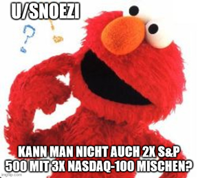

Ich habe das für dich einfach noch einmal durchprobiert. Hierbei mischte ich in die 50%, 65% und 80% Portfolios anstatt 2x Nasdaq-100 den 3x Nasdaq-100 hinein. Leider habe ich schon zu viele Bilder in diesem Post, daher muss ich die Grafiken dafür verlinken.

* 50% Portfolio: [https://paste.pics/2d365ea66f1324188cf472fd5baff8d2](https://paste.pics/2d365ea66f1324188cf472fd5baff8d2)
* 65% Portfolio: [https://paste.pics/19466d97d5875f0267d0555b82a66a3b](https://paste.pics/19466d97d5875f0267d0555b82a66a3b)
* 80% Portfolio: [https://paste.pics/82e701f8752dfed4ed235194e240d193](https://paste.pics/82e701f8752dfed4ed235194e240d193)

Wie du sieht nimmt dadurch natürlich das Risiko schon bei einem kleineren Anteil von Nasdaq-100 zu. Zum Beispiel beim 50% Portfolio liegt das Risiko, aber auch das CAGR schon bei 15% 3x Nasdaq-100 im gleichen Bereich wie zuvor bei 30% 2x Nasdaq-100. Ähnlich sieht es beim 65% Portfolio aus. Hier ist schon bei 5% 3x Nasdaq-100 das gleiche Risiko erreicht wie bei 10% 2x Nasdaq-100. Und so geht es dann weiter.

Zusätzlich kommt dann eben auch das Emittentenrisiko hinzu. So dass ich jetzt nicht davon überzeugt bin, dass eine Mischung dieser Art wirklich viel besser ist als etwas mehr Prozent vom 2x Nasdaq-100.

## Quellen

\[1\] [https://papers.ssrn.com/sol3/papers.cfm?abstract\_id=2741701](https://papers.ssrn.com/sol3/papers.cfm?abstract_id=2741701)

\[2\] [https://www.reddit.com/r/mauerstrassenwetten/comments/sm4n84/comment/hw1yw7v/?utm\_source=share&utm\_medium=web2x&context=3](https://www.reddit.com/r/mauerstrassenwetten/comments/sm4n84/comment/hw1yw7v/?utm_source=share&utm_medium=web2x&context=3)

\[3\] [https://alleantworten.de/wie-viele-boersentage-im-jahr](https://alleantworten.de/wie-viele-boersentage-im-jahr)

\[4\] [https://code.launchpad.net/zgea](https://code.launchpad.net/zgea)
