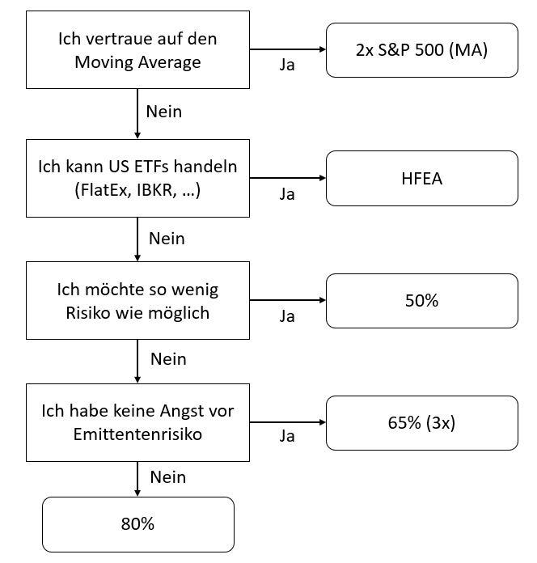

# Moving Average und andere Trendfolge-Erkennungen

Wie kann ich HFEA für mich adaptieren? Diese Frage hat ZahlGraf in seinem letzten Teil der Reihe mit einem kleinen Entscheidungsdiagramm beantwortet:

In diesem Mini-Kapitel möchte ich helfen, die erste Frage des Entscheidungsbaums besser beantworten zu können: "Ich vertraue auf den Moving Average".
Um zu vertrauen, muss man meistens verstehen und ich möchte meinen Teil dazu leisten, dass ihr ein besseres Verständnis für den Moving Average bekommt.
Zusätzlich werde ich weitere Indikatoren vorstellen, die man Anstelle des Moving Averages verwenden kann.

Bevor wir mit dem Moving Average voll einsteigen, möchte ich nochmal einen Faktor hervorheben, der für unsere Verständnis und die S&P 500 MA essentiell ist:

**Wir hoffen _grundsätzlich_ auf steigende Kurse!**

Wir hebeln den S&P 500 oder den NASDAQ. Dabei kaufen wir aber immer noch einen ETF und kein Derivat mit irgendwelchen Put Optionen.
Folglich profitieren wir von steigenden Kursen. Unser Ziel: Wir möchten dabei sein, wenn die Kurse steigen und nicht dabei sein, wenn die Kurse sinken (Ich weiß - das widerstrebt dem Grundvorgehen in diesem Subreddit...)

Um dieses Ziel zu erreichen, können wir Trendfolge-Analysen anwenden. Dabei betrachten wir sowohl steigende Kurse, als auch sinkende Kurse als Trend (Aufwärtstrend und Abwärtstrend).
Wir wollen bei den Aufwärtstrends dabei sein und bei den Abwärtstrends an der Seitenlinie stehen und zugucken, wie andere Leute ihr Geld verlieren.

Trendfolge-Analysen gehören zu den technischen Analysen. Professor Goldgraf hat sich im Podcast von /u/monchella klar positioniert: (TODO)

## Unsere erstes Instrument zur Trendfolgeanalyse: Der stupide Vergleich mit dem Vorgänger
Überlegen wir einmal naiv, was eine ganz einfache Strategie zum Erkennen eines Trends sein könnte... Das Einfachste was mir einfällt ist folgendes:
Wenn der heutige Kurs höher ist als der gestrige, sind wir in einem Aufwärtstrend, andernfalls sind wir in einem Abwärtstrend.

(Bild 1)

Das könnte ganz gut funktionieren, aber gucken wir uns mal folgendes Beispiel an:

(Bild 2)

In diesem Beispiel ist ganz klar ein Aufwärtstrend erkennbar, unsere dumme Strategie ist aber nicht im Stande, diesen Trend zu erkennen. Scheinbar reicht es nicht aus, einfach nur den vorigen Wert anzugucken...

## Unser zweiter Versuch: Der Moving Average

Was wäre, wenn wir uns nicht nur den unmittelbar vorhergegangen Wert angucken, sondern noch weitere Werte die in der Vergangenheit liegen?
